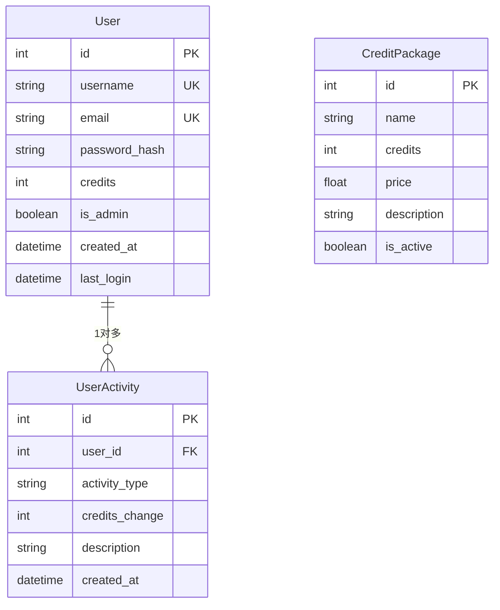

# Models 数据库模型详解

## 📋 目录

1. [项目概述](#项目概述)
2. [导入语句详解](#导入语句详解)
3. [数据库实例创建](#数据库实例创建)
4. [User用户模型](#user用户模型)
5. [UserActivity活动记录模型](#useractivity活动记录模型)
6. [CreditPackage积分套餐模型](#creditpackage积分套餐模型)
7. [积分消耗常量](#积分消耗常量)
8. [技术总结](#技术总结)

---

## 📖 项目概述

`models.py` 是**数据库模型定义文件**，使用SQLAlchemy ORM定义了系统的所有数据表结构和关系。

### 主要功能

- 👤 **用户模型**: 管理用户信息、认证、积分
- 📝 **活动记录**: 追踪用户操作和积分变动
- 💳 **积分套餐**: 定义可购买的积分包
- 🔐 **密码安全**: 密码哈希存储和验证
- 💰 **积分系统**: 完整的积分管理机制

### 数据库关系图



### 文件统计

- **总行数**: 68行
- **导入模块**: 4个
- **模型类数量**: 3个（User、UserActivity、CreditPackage）
- **方法数量**: 5个（密码处理2个 + 积分管理3个）
- **关系数量**: 1个（User ↔ UserActivity）

---

## 📦 导入语句详解

### ORM和认证导入（第1-4行）

```python
from flask_sqlalchemy import SQLAlchemy            # 第1行
from flask_login import UserMixin                  # 第2行
from werkzeug.security import generate_password_hash, check_password_hash  # 第3行
import datetime                                    # 第4行
```

**第1行详解**：`from flask_sqlalchemy import SQLAlchemy`

```python
from flask_sqlalchemy import SQLAlchemy

# Flask-SQLAlchemy详解
# 这是Flask的SQLAlchemy扩展，提供ORM功能

# ORM（Object-Relational Mapping）对象关系映射
# 作用：将数据库表映射为Python类
# 优势：用面向对象的方式操作数据库

# 传统SQL方式（不使用ORM）：
import sqlite3
conn = sqlite3.connect('users.db')
cursor = conn.cursor()
cursor.execute("SELECT * FROM users WHERE id=?", (1,))
user = cursor.fetchone()
conn.close()

# 使用ORM（Flask-SQLAlchemy）：
user = User.query.get(1)
# 更简洁、更Pythonic

# SQLAlchemy主要功能：
# 1. 定义数据模型（类 → 表）
# 2. 查询数据（方法 → SQL）
# 3. 关系映射（外键 → 对象引用）
# 4. 事务管理（自动提交/回滚）
# 5. 连接池管理

# SQLAlchemy vs 原生SQL
# SQLAlchemy优势：
# ✓ 防止SQL注入
# ✓ 数据库无关（支持MySQL、PostgreSQL、SQLite等）
# ✓ 自动类型转换
# ✓ 支持复杂查询
# ✓ 事务自动管理

# 使用示例：
db = SQLAlchemy()  # 创建数据库实例
db.init_app(app)   # 绑定到Flask应用

# 定义模型
class User(db.Model):
    id = db.Column(db.Integer, primary_key=True)
    username = db.Column(db.String(80))

# 查询数据
user = User.query.filter_by(username='张三').first()

# 添加数据
new_user = User(username='李四')
db.session.add(new_user)
db.session.commit()

# 更新数据
user.username = '王五'
db.session.commit()

# 删除数据
db.session.delete(user)
db.session.commit()
```

**第2行详解**：`from flask_login import UserMixin`

```python
from flask_login import UserMixin

# UserMixin详解
# 这是Flask-Login提供的混入类（Mixin）

# 什么是Mixin？
# Mixin是一种设计模式，为类添加额外功能
# 通过多重继承使用

# UserMixin提供的方法：
class User(UserMixin, db.Model):
    pass

# 自动获得以下方法：
user.is_authenticated  # 是否已认证（通常返回True）
user.is_active         # 账户是否激活（通常返回True）
user.is_anonymous      # 是否是匿名用户（返回False）
user.get_id()          # 获取用户ID（返回字符串）

# 为什么需要UserMixin？
# Flask-Login要求用户类必须实现这4个属性/方法

# 不使用UserMixin（手动实现）：
class User(db.Model):
    @property
    def is_authenticated(self):
        return True
    
    @property
    def is_active(self):
        return True
    
    @property
    def is_anonymous(self):
        return False
    
    def get_id(self):
        return str(self.id)

# 使用UserMixin（自动实现）：
class User(UserMixin, db.Model):
    pass  # 自动获得上述4个方法

# 多重继承
# class User(UserMixin, db.Model):
#              ↑         ↑
#        Flask-Login  SQLAlchemy
#          功能      ORM功能

# Python的MRO（Method Resolution Order）方法解析顺序
# User → UserMixin → db.Model → object
# 从左到右查找方法

# 实际应用
# 在Flask-Login中使用
from flask_login import login_required, current_user

@app.route('/profile')
@login_required  # 要求用户登录
def profile():
    if current_user.is_authenticated:
        # current_user.is_authenticated来自UserMixin
        return f"欢迎，{current_user.username}"
```

**第3行详解**：`from werkzeug.security import generate_password_hash, check_password_hash`

```python
from werkzeug.security import generate_password_hash, check_password_hash

# Werkzeug安全模块
# Werkzeug是Flask的底层WSGI工具库

# generate_password_hash()
# 功能：将明文密码转换为安全的哈希值

# 使用示例：
password = "my_secret_password"
hash_value = generate_password_hash(password)
print(hash_value)
# 输出类似：
# pbkdf2:sha256:260000$salt$hash_value

# 哈希算法详解
# 默认算法：pbkdf2:sha256
# - pbkdf2：密码衍生函数（Password-Based Key Derivation Function 2）
# - sha256：SHA-256哈希算法
# - 260000：迭代次数（增加破解难度）
# - salt：随机盐值（防止彩虹表攻击）

# 密码哈希的安全特性：
# 1. 单向性：无法从哈希值还原密码
hash_to_password(hash_value)  # ✗ 不可能

# 2. 唯一性：不同密码产生不同哈希
generate_password_hash("password1")  # 哈希A
generate_password_hash("password2")  # 哈希B（不同）

# 3. 雪崩效应：微小改变导致完全不同的哈希
generate_password_hash("password")   # 哈希X
generate_password_hash("Password")   # 哈希Y（完全不同）

# 4. 加盐：相同密码产生不同哈希
hash1 = generate_password_hash("password")
hash2 = generate_password_hash("password")
# hash1 ≠ hash2（因为盐值不同）

# check_password_hash()
# 功能：验证密码是否正确

# 使用示例：
stored_hash = "pbkdf2:sha256:260000$..."
user_input = "my_secret_password"

is_valid = check_password_hash(stored_hash, user_input)
print(is_valid)  # True或False

# 验证流程：
# 1. 从哈希值中提取盐值
# 2. 用相同盐值对输入密码哈希
# 3. 比较两个哈希值是否相同

# 完整的密码认证流程
# 注册时：
def register(username, password):
    user = User(
        username=username,
        password_hash=generate_password_hash(password)  # 存储哈希
    )
    db.session.add(user)
    db.session.commit()

# 登录时：
def login(username, password):
    user = User.query.filter_by(username=username).first()
    if user and check_password_hash(user.password_hash, password):
        # 密码正确
        login_user(user)
        return True
    return False

# 为什么不能直接存储明文密码？
# 安全风险：
# ✗ 数据库泄露 → 所有密码泄露
# ✗ 管理员可以看到密码
# ✗ 用户在多个网站使用相同密码

# 使用哈希的优势：
# ✓ 数据库泄露 → 哈希值无法还原
# ✓ 管理员无法知道原密码
# ✓ 即使泄露也不影响其他网站

# 哈希算法对比
# MD5：     ✗ 已被破解，不安全
# SHA-1：   ✗ 已被破解，不安全
# SHA-256： ✓ 安全，但需要加盐
# bcrypt：  ✓ 专门用于密码，自动加盐
# pbkdf2：  ✓ 标准算法，自动加盐（Werkzeug默认）

# generate_password_hash参数
hash_value = generate_password_hash(
    password,
    method='pbkdf2:sha256',  # 哈希方法
    salt_length=16           # 盐值长度
)
```

**第4行详解**：`import datetime`

```python
import datetime

# datetime模块
# Python标准库，处理日期和时间

# 主要类：
# - datetime.datetime：日期时间
# - datetime.date：日期
# - datetime.time：时间
# - datetime.timedelta：时间差

# datetime.datetime用法
# 1. 获取当前时间
now = datetime.datetime.now()
print(now)  # 2024-01-15 14:30:25.123456

# 2. 获取UTC时间（本项目使用）
utc_now = datetime.datetime.utcnow()
print(utc_now)  # 2024-01-15 06:30:25.123456（UTC时间）

# 3. 创建指定时间
dt = datetime.datetime(2024, 1, 15, 14, 30, 25)
print(dt)  # 2024-01-15 14:30:25

# 4. 时间格式化
now.strftime('%Y-%m-%d %H:%M:%S')
# '2024-01-15 14:30:25'

# 5. 字符串解析为时间
dt = datetime.datetime.strptime('2024-01-15', '%Y-%m-%d')

# 6. 时间运算
tomorrow = now + datetime.timedelta(days=1)
yesterday = now - datetime.timedelta(days=1)

# 在数据库模型中的应用
class User(db.Model):
    created_at = db.Column(
        db.DateTime,
        default=datetime.datetime.utcnow  # 默认值：UTC当前时间
    )

# 注意：传递函数对象，不是调用结果
# 正确：default=datetime.datetime.utcnow
# 错误：default=datetime.datetime.utcnow()

# 为什么用utcnow而不是now？
# UTC（Coordinated Universal Time）协调世界时
# 优势：
# 1. 统一标准，避免时区混淆
# 2. 数据库存储UTC，显示时转换为本地时区
# 3. 服务器迁移不受影响

# now() vs utcnow()
now = datetime.datetime.now()
# 2024-01-15 14:30:25（本地时间，北京UTC+8）

utcnow = datetime.datetime.utcnow()
# 2024-01-15 06:30:25（UTC时间）

# 时间格式化代码
# %Y - 四位年份（2024）
# %m - 月份（01-12）
# %d - 日期（01-31）
# %H - 小时（00-23）
# %M - 分钟（00-59）
# %S - 秒（00-59）

# 实际使用示例
user = User.query.get(1)
print(user.created_at)
# 2024-01-15 06:30:25

# 转换为本地时间显示
import pytz
beijing_tz = pytz.timezone('Asia/Shanghai')
local_time = user.created_at.replace(tzinfo=pytz.utc).astimezone(beijing_tz)
print(local_time)
# 2024-01-15 14:30:25+08:00
```

---

## 🗄️ 数据库实例创建

### 全局数据库对象（第6行）

```python
db = SQLAlchemy()                                  # 第6行
```

**数据库实例详解（第6行）**：

```python
db = SQLAlchemy()

# SQLAlchemy实例
# 这是整个应用的数据库对象

# 为什么在这里创建？
# 应用工厂模式（Application Factory Pattern）

# 传统模式（不推荐）：
app = Flask(__name__)
db = SQLAlchemy(app)  # 直接绑定到app

# 问题：
# 1. 难以创建多个应用实例
# 2. 测试时无法使用不同配置
# 3. 循环导入问题

# 应用工厂模式（推荐）：
# 第1步：创建扩展实例（不绑定应用）
db = SQLAlchemy()

# 第2步：在应用初始化时绑定
def create_app():
    app = Flask(__name__)
    db.init_app(app)  # 延迟绑定
    return app

# 优势：
# 1. 支持多个应用实例
# 2. 测试时可以创建测试应用
# 3. 避免循环导入
# 4. 配置更灵活

# db对象提供的功能
# 1. 模型基类
class User(db.Model):
    pass

# 2. 数据类型
db.Integer, db.String, db.DateTime, etc.

# 3. 会话管理
db.session.add(user)
db.session.commit()
db.session.rollback()

# 4. 表操作
db.create_all()  # 创建所有表
db.drop_all()    # 删除所有表

# 5. 查询接口
User.query.all()
User.query.get(1)
User.query.filter_by(username='张三').first()

# db.session详解
# session是SQLAlchemy的核心概念
# 类似于数据库事务的会话

# 添加数据
user = User(username='张三')
db.session.add(user)      # 添加到会话
db.session.commit()       # 提交到数据库

# 更新数据
user = User.query.get(1)
user.username = '李四'
db.session.commit()       # 自动检测修改并保存

# 删除数据
user = User.query.get(1)
db.session.delete(user)
db.session.commit()

# 回滚操作
try:
    user = User(username='张三')
    db.session.add(user)
    # ... 其他操作 ...
    db.session.commit()
except Exception as e:
    db.session.rollback()  # 出错时回滚

# 为什么要commit？
# SQLAlchemy使用事务
# add/delete/modify只是标记操作
# commit才真正写入数据库

# 事务的ACID特性：
# Atomicity（原子性）：全部成功或全部失败
# Consistency（一致性）：数据保持一致状态
# Isolation（隔离性）：事务之间互不干扰
# Durability（持久性）：提交后永久保存

# 完整的应用初始化
# models.py
db = SQLAlchemy()

# app.py
from models import db

app = Flask(__name__)
app.config['SQLALCHEMY_DATABASE_URI'] = 'sqlite:///users.db'
db.init_app(app)

# 创建表
with app.app_context():
    db.create_all()
```

---

## 👤 User用户模型

### 类定义（第8-9行）

```python
class User(UserMixin, db.Model):                   # 第8行
    """用户模型，包含用户基本信息和积分"""              # 第9行
```

**类定义详解（第8-9行）**：

```python
class User(UserMixin, db.Model):
    """用户模型，包含用户基本信息和积分"""

# 多重继承
# class User(UserMixin, db.Model):
#              ↑         ↑
#        Flask-Login  SQLAlchemy
#          认证功能    ORM功能

# UserMixin提供：
# - is_authenticated：是否已认证
# - is_active：是否激活
# - is_anonymous：是否匿名
# - get_id()：获取用户ID

# db.Model提供：
# - 数据库映射功能
# - 查询接口（User.query）
# - 表名自动生成

# 表名生成规则
# 类名 → 表名（自动转换）
class User(db.Model):
    pass
# 表名：user（小写）

class UserActivity(db.Model):
    pass
# 表名：user_activity（蛇形命名）

# 自定义表名
class User(db.Model):
    __tablename__ = 'users'  # 自定义表名

# 文档字符串（docstring）
"""用户模型，包含用户基本信息和积分"""
# 作用：
# 1. 提供类的说明文档
# 2. 可通过help(User)查看
# 3. IDE会显示提示
```

### 字段定义（第10-17行）

```python
id = db.Column(db.Integer, primary_key=True)       # 第10行
username = db.Column(db.String(80), unique=True, nullable=False)  # 第11行
email = db.Column(db.String(120), unique=True, nullable=False)    # 第12行
password_hash = db.Column(db.String(128))          # 第13行
credits = db.Column(db.Integer, default=100)  # 用户积分，默认100  # 第14行
is_admin = db.Column(db.Boolean, default=False)  # 是否是管理员   # 第15行
created_at = db.Column(db.DateTime, default=datetime.datetime.utcnow)  # 第16行
last_login = db.Column(db.DateTime, default=datetime.datetime.utcnow)  # 第17行
```

**字段定义详解（第10行）**：

```python
id = db.Column(db.Integer, primary_key=True)

# db.Column()
# 定义数据库字段/列

# 语法结构：
db.Column(
    数据类型,        # 必需：字段的数据类型
    约束1,          # 可选：如primary_key、unique等
    约束2,
    ...
)

# db.Integer
# 整数类型

# 数据类型对比：
db.Integer         # 整数（通常是32位）
db.BigInteger      # 大整数（64位）
db.SmallInteger    # 小整数（16位）
db.String(长度)    # 字符串（需要指定最大长度）
db.Text            # 长文本（不限长度）
db.Boolean         # 布尔值（True/False）
db.DateTime        # 日期时间
db.Date            # 日期
db.Time            # 时间
db.Float           # 浮点数
db.Numeric         # 精确数值（用于金额）

# primary_key=True
# 主键约束

# 主键特性：
# 1. 唯一性：每行的主键值必须唯一
# 2. 非空：主键不能为NULL
# 3. 自增：Integer主键通常自动递增
# 4. 索引：主键自动创建索引

# 主键作用：
# 1. 唯一标识每一行数据
# 2. 外键引用的目标
# 3. 快速查询

# 使用示例：
user1 = User(username='张三')
db.session.add(user1)
db.session.commit()
print(user1.id)  # 1（自动分配）

user2 = User(username='李四')
db.session.add(user2)
db.session.commit()
print(user2.id)  # 2（自动递增）

# 查询时使用主键
user = User.query.get(1)  # 根据主键查询（最快）
```

**字段定义详解（第11行）**：

```python
username = db.Column(db.String(80), unique=True, nullable=False)

# db.String(80)
# 可变长度字符串，最大80字符

# 为什么指定长度？
# 1. 数据库需要知道分配多少空间
# 2. 限制数据大小
# 3. 提高性能

# 长度选择建议：
db.String(80)   # 用户名（通常20-80字符）
db.String(120)  # 邮箱（通常不超过120字符）
db.String(128)  # 密码哈希（固定长度）
db.String(255)  # 描述/备注
db.Text         # 文章内容（不限长度）

# unique=True
# 唯一性约束

# 作用：
# 1. 确保字段值唯一
# 2. 自动创建唯一索引
# 3. 插入重复值时抛出异常

# 示例：
user1 = User(username='张三', email='a@example.com')
db.session.add(user1)
db.session.commit()  # 成功

user2 = User(username='张三', email='b@example.com')
db.session.add(user2)
db.session.commit()  # ✗ IntegrityError: UNIQUE constraint failed

# 为什么username需要唯一？
# 用户名用于登录，必须唯一

# nullable=False
# 非空约束

# 作用：
# 1. 字段不能为NULL
# 2. 插入空值时抛出异常
# 3. 确保数据完整性

# 示例：
user = User(email='a@example.com')  # 没有username
db.session.add(user)
db.session.commit()  # ✗ IntegrityError: NOT NULL constraint failed

# nullable默认值
db.Column(db.String(80))  # nullable=True（默认）
db.Column(db.String(80), nullable=False)  # 明确指定非空

# 约束组合
username = db.Column(
    db.String(80),      # 类型：字符串，最大80字符
    unique=True,        # 约束：唯一
    nullable=False      # 约束：非空
)
# 含义：用户名必须填写，且不能重复
```

**字段定义详解（第12-13行）**：

```python
email = db.Column(db.String(120), unique=True, nullable=False)
password_hash = db.Column(db.String(128))

# email字段
# 与username类似，但长度更大

# 为什么是120字符？
# 邮箱格式：username@domain.com
# RFC 5321标准：最大254字符
# 实际应用：通常不超过120字符

# password_hash字段
# 存储密码的哈希值，不是明文密码

# 为什么是128字符？
# pbkdf2:sha256哈希值通常约120字符
# 预留空间以容纳未来的哈希算法

# 为什么没有nullable=False？
# 默认nullable=True
# 允许某些特殊账户没有密码
# 或使用第三方登录（OAuth）的用户

# 安全对比：
# ✗ 不安全：
password = db.Column(db.String(50))  # 存储明文密码

# ✓ 安全：
password_hash = db.Column(db.String(128))  # 存储哈希值

# 使用示例：
user = User(
    username='张三',
    email='zhangsan@example.com'
)
user.set_password('my_password')  # 自动哈希
db.session.add(user)
db.session.commit()

# 数据库中存储的是：
# password_hash: "pbkdf2:sha256:260000$..."
# 不是 "my_password"
```

**字段定义详解（第14-17行）**：

```python
credits = db.Column(db.Integer, default=100)
is_admin = db.Column(db.Boolean, default=False)
created_at = db.Column(db.DateTime, default=datetime.datetime.utcnow)
last_login = db.Column(db.DateTime, default=datetime.datetime.utcnow)

# default参数
# 默认值，插入数据时如果未提供值，使用默认值

# default=100
# 数值默认值
user = User(username='张三', email='a@example.com')
# user.credits 自动为 100

# default=False
# 布尔值默认值
user = User(username='张三', email='a@example.com')
# user.is_admin 自动为 False

# default=datetime.datetime.utcnow
# 函数默认值（注意：传递函数对象，不调用）

# 正确写法：
default=datetime.datetime.utcnow

# 错误写法：
default=datetime.datetime.utcnow()  # ✗ 函数立即执行

# 为什么不能加括号？
# 加括号：函数立即执行，所有记录使用同一时间
created_at = db.Column(db.DateTime, default=datetime.datetime.utcnow())
# ✗ 所有用户的created_at都是程序启动时的时间

# 不加括号：每次插入时才调用函数
created_at = db.Column(db.DateTime, default=datetime.datetime.utcnow)
# ✓ 每个用户的created_at是各自创建时的时间

# db.Boolean
# 布尔类型（True/False）

# 数据库存储：
# SQLite：0（False）/1（True）
# PostgreSQL：false/true
# MySQL：0/1 或 false/true

# 使用示例：
if user.is_admin:
    print("管理员")
else:
    print("普通用户")

# db.DateTime
# 日期时间类型

# 存储格式：
# 数据库：'2024-01-15 14:30:25'
# Python：datetime.datetime(2024, 1, 15, 14, 30, 25)

# 使用示例：
user = User.query.get(1)
print(user.created_at)
# 2024-01-15 06:30:25

# 格式化显示
print(user.created_at.strftime('%Y年%m月%d日'))
# 2024年01月15日

# 计算时间差
from datetime import timedelta
now = datetime.datetime.utcnow()
delta = now - user.created_at
print(f"注册了{delta.days}天")

# 字段总结
# id: 主键，自动递增
# username: 用户名，唯一，非空
# email: 邮箱，唯一，非空
# password_hash: 密码哈希
# credits: 积分，默认100
# is_admin: 是否管理员，默认False
# created_at: 创建时间，自动设置
# last_login: 最后登录，自动设置
```

### 关系定义（第19-20行）

```python
# 关联用户的活动记录                          # 第19行（注释）
activities = db.relationship('UserActivity', backref='user', lazy='dynamic')  # 第20行
```

**关系定义详解（第20行）**：

```python
activities = db.relationship('UserActivity', backref='user', lazy='dynamic')

# db.relationship()
# 定义表之间的关系（不是数据库字段）

# 这不是数据库列！
# 这是ORM提供的便利属性
# 用于访问关联的对象

# 关系类型：
# 一对多：User → UserActivity（一个用户有多个活动）
# 多对一：UserActivity → User（多个活动属于一个用户）
# 一对一：User → Profile
# 多对多：Student ↔ Course

# 'UserActivity'
# 关联的模型类名（字符串）

# 为什么用字符串而不是类？
# 避免循环导入问题
# SQLAlchemy会自动解析

# backref='user'
# 反向引用，在UserActivity中自动创建user属性

# 效果：
# 在User中：
user = User.query.get(1)
activities = user.activities  # 访问该用户的所有活动

# 在UserActivity中（自动创建）：
activity = UserActivity.query.get(1)
user = activity.user  # 访问活动所属的用户

# lazy='dynamic'
# 懒加载模式

# 加载模式对比：
# lazy='select'（默认）：
user.activities  # 立即查询，返回列表
# SQL: SELECT * FROM user_activity WHERE user_id=1

# lazy='dynamic'：
user.activities  # 返回查询对象，不立即查询
# 可以继续添加过滤条件
user.activities.filter_by(activity_type='login').all()

# lazy='joined'：
user = User.query.get(1)  # 使用JOIN查询
# SQL: SELECT * FROM user JOIN user_activity ON ...

# lazy='subquery'：
# 使用子查询

# 为什么本项目用dynamic？
# 用户可能有很多活动记录
# dynamic允许分页、过滤等操作
# 不会一次性加载所有记录

# 使用示例：
user = User.query.get(1)

# 获取所有活动（返回查询对象）
all_activities = user.activities.all()

# 过滤活动
login_activities = user.activities.filter_by(
    activity_type='login'
).all()

# 排序
recent_activities = user.activities.order_by(
    UserActivity.created_at.desc()
).limit(10).all()

# 计数
activity_count = user.activities.count()

# 关系的完整定义
# User模型中：
class User(db.Model):
    id = db.Column(db.Integer, primary_key=True)
    activities = db.relationship('UserActivity', backref='user', lazy='dynamic')

# UserActivity模型中：
class UserActivity(db.Model):
    id = db.Column(db.Integer, primary_key=True)
    user_id = db.Column(db.Integer, db.ForeignKey('user.id'))
    # user属性由backref自动创建

# 使用关系
# 创建活动并关联用户
user = User.query.get(1)
activity = UserActivity(
    activity_type='login',
    description='用户登录'
)
user.activities.append(activity)  # 自动设置user_id
db.session.commit()

# 或者：
activity = UserActivity(
    user_id=user.id,  # 手动设置
    activity_type='login'
)
db.session.add(activity)
db.session.commit()

# 或者（使用backref）：
activity = UserActivity(
    user=user,  # 通过关系设置
    activity_type='login'
)
db.session.add(activity)
db.session.commit()
```

### 密码处理方法（第22-26行）

```python
def set_password(self, password):                 # 第22行
    self.password_hash = generate_password_hash(password)  # 第23行
    
def check_password(self, password):               # 第25行
    return check_password_hash(self.password_hash, password)  # 第26行
```

**密码处理方法详解（第22-26行）**：

```python
def set_password(self, password):
    self.password_hash = generate_password_hash(password)

def check_password(self, password):
    return check_password_hash(self.password_hash, password)

# set_password()方法
# 设置密码（加密存储）

# self参数
# 实例方法的第一个参数
# 指向当前对象

# password参数
# 明文密码（用户输入）

# generate_password_hash()
# 将明文密码转换为哈希值

# 使用示例：
user = User(username='张三', email='a@example.com')
user.set_password('my_secret_password')
# user.password_hash = "pbkdf2:sha256:260000$..."

# 为什么封装成方法？
# 1. 隐藏实现细节
# 2. 确保密码总是被哈希
# 3. 代码更易读

# 不好的做法：
user.password_hash = password  # ✗ 明文存储

# 好的做法：
user.set_password(password)  # ✓ 自动哈希

# check_password()方法
# 验证密码是否正确

# 返回值：
# True：密码正确
# False：密码错误

# 使用示例：
user = User.query.filter_by(username='张三').first()
is_valid = user.check_password('my_secret_password')

if is_valid:
    print("密码正确，允许登录")
else:
    print("密码错误")

# 完整的登录流程：
def login(username, password):
    # 1. 查找用户
    user = User.query.filter_by(username=username).first()
    
    # 2. 检查用户是否存在
    if user is None:
        return False, "用户不存在"
    
    # 3. 验证密码
    if not user.check_password(password):
        return False, "密码错误"
    
    # 4. 登录成功
    return True, "登录成功"

# 完整的注册流程：
def register(username, email, password):
    # 1. 创建用户对象
    user = User(username=username, email=email)
    
    # 2. 设置密码（自动哈希）
    user.set_password(password)
    
    # 3. 保存到数据库
    db.session.add(user)
    db.session.commit()
    
    return user

# 为什么不直接存储密码？
# 安全原因：
# ✗ 数据库泄露 → 所有密码泄露
# ✗ 内部人员可以查看密码
# ✗ 用户在多个网站用同样密码

# 使用哈希的优势：
# ✓ 数据库泄露 → 哈希值无法还原
# ✓ 即使管理员也不知道密码
# ✓ 每个密码独立加盐，无法批量破解

# 密码哈希示例：
user = User(username='张三', email='a@example.com')
user.set_password('password123')
print(user.password_hash)
# pbkdf2:sha256:260000$rT8YzqKF$abc...

# 验证过程：
user.check_password('password123')  # True
user.check_password('wrong')        # False
```

### 积分管理方法（第28-41行）

```python
def add_credits(self, amount):                    # 第28行
    """添加积分"""                                # 第29行
    self.credits += amount                        # 第30行
    
def deduct_credits(self, amount):                 # 第32行
    """扣除积分"""                                # 第33行
    if self.credits >= amount:                    # 第34行
        self.credits -= amount                    # 第35行
        return True                               # 第36行
    return False                                  # 第37行

def has_enough_credits(self, required_credits):   # 第39行
    """检查是否有足够的积分"""                     # 第40行
    return self.credits >= required_credits or self.is_admin  # 第41行
```

**积分管理方法详解（第28-41行）**：

```python
def add_credits(self, amount):
    """添加积分"""
    self.credits += amount

# add_credits()方法
# 增加用户积分

# amount参数
# 要增加的积分数量

# +=运算符
# 自增运算
self.credits += amount
# 等价于：
self.credits = self.credits + amount

# 使用示例：
user = User.query.get(1)
print(user.credits)  # 100

user.add_credits(50)
print(user.credits)  # 150

db.session.commit()  # 保存到数据库

# 应用场景：
# 1. 用户购买积分
user.add_credits(100)

# 2. 系统奖励
user.add_credits(10)

# 3. 管理员赠送
user.add_credits(500)

# deduct_credits()方法
# 扣除用户积分

def deduct_credits(self, amount):
    """扣除积分"""
    if self.credits >= amount:
        self.credits -= amount
        return True
    return False

# 返回值
# True：扣除成功
# False：积分不足，扣除失败

# 为什么要检查余额？
# 防止积分变成负数

# 使用示例：
user = User.query.get(1)
print(user.credits)  # 100

# 情况1：积分足够
success = user.deduct_credits(30)
print(success)       # True
print(user.credits)  # 70

# 情况2：积分不足
success = user.deduct_credits(200)
print(success)       # False
print(user.credits)  # 70（不变）

db.session.commit()

# 应用场景：
# 搜索文献（消耗10积分）
if user.deduct_credits(10):
    # 执行搜索
    perform_search()
else:
    # 提示积分不足
    flash("积分不足，请充值")

# 下载文件（消耗5积分）
if user.deduct_credits(5):
    return send_file(filename)
else:
    return jsonify({"error": "积分不足"}), 403

# has_enough_credits()方法
# 检查积分是否足够

def has_enough_credits(self, required_credits):
    """检查是否有足够的积分"""
    return self.credits >= required_credits or self.is_admin

# 返回值
# True：积分足够或是管理员
# False：积分不足且不是管理员

# or逻辑运算符
# A or B：A为True或B为True，结果为True

# 为什么管理员总是返回True？
# 管理员有无限积分权限

# 使用示例：
# 普通用户
user = User(credits=50, is_admin=False)
user.has_enough_credits(30)   # True（积分足够）
user.has_enough_credits(100)  # False（积分不足）

# 管理员
admin = User(credits=0, is_admin=True)
admin.has_enough_credits(1000)  # True（管理员特权）

# 应用场景：
# 在执行操作前检查
if not user.has_enough_credits(10):
    return jsonify({"error": "积分不足"}), 403

# 执行操作
perform_action()

# 完整的积分消耗流程：
def search_papers(user, keywords):
    # 1. 检查积分
    if not user.has_enough_credits(10):
        return {"error": "积分不足"}
    
    # 2. 扣除积分
    user.deduct_credits(10)
    
    # 3. 记录活动
    activity = UserActivity(
        user_id=user.id,
        activity_type='search',
        credits_change=-10,
        description=f'搜索：{keywords}'
    )
    db.session.add(activity)
    
    # 4. 提交事务
    db.session.commit()
    
    # 5. 执行搜索
    results = perform_search(keywords)
    
    return {"results": results}

# 积分管理最佳实践：
# 1. 扣除前检查余额
# 2. 记录每次变动
# 3. 使用事务确保一致性
# 4. 管理员特殊处理
```

---

## 📝 UserActivity活动记录模型

### 类定义和字段（第43-50行）

```python
class UserActivity(db.Model):                     # 第43行
    """用户活动记录，记录用户的操作和积分变动"""     # 第44行
    id = db.Column(db.Integer, primary_key=True)  # 第45行
    user_id = db.Column(db.Integer, db.ForeignKey('user.id'))  # 第46行
    activity_type = db.Column(db.String(50))  # 活动类型: search, analyze, login, etc.  # 第47行
    credits_change = db.Column(db.Integer)  # 积分变动  # 第48行
    description = db.Column(db.String(255))  # 活动描述  # 第49行
    created_at = db.Column(db.DateTime, default=datetime.datetime.utcnow)  # 第50行
```

**UserActivity模型详解（第43-50行）**：

```python
class UserActivity(db.Model):
    """用户活动记录，记录用户的操作和积分变动"""

# 活动记录模型
# 作用：
# 1. 审计日志：记录用户所有操作
# 2. 积分追踪：记录积分变化历史
# 3. 数据分析：分析用户行为
# 4. 问题排查：追溯历史操作

# 字段详解

# id字段
id = db.Column(db.Integer, primary_key=True)
# 主键，自动递增

# user_id字段（外键）
user_id = db.Column(db.Integer, db.ForeignKey('user.id'))

# db.ForeignKey('user.id')
# 外键约束，引用user表的id字段

# 外键作用：
# 1. 建立表之间的关联
# 2. 确保引用完整性
# 3. 支持级联操作

# 引用完整性：
# ✓ 允许：user_id=1（user表中存在id=1的记录）
# ✗ 拒绝：user_id=999（user表中不存在id=999）

# 'user.id'格式
# 表名.字段名（小写）

# 为什么是'user'而不是'User'？
# SQLAlchemy自动将类名转为小写表名

# 使用示例：
activity = UserActivity(
    user_id=1,  # 必须存在id=1的用户
    activity_type='login'
)
db.session.add(activity)
db.session.commit()

# activity_type字段
activity_type = db.Column(db.String(50))

# 活动类型示例：
# 'login'：登录
# 'search'：搜索文献
# 'analyze'：分析文献
# 'download'：下载文件
# 'upload'：上传文件
# 'purchase'：购买积分

# credits_change字段
credits_change = db.Column(db.Integer)

# 积分变动（可正可负）
# 正数：增加积分
#   +100：购买积分
#   +50：系统奖励
# 负数：扣除积分
#   -10：搜索消耗
#   -20：分析消耗

# 使用示例：
# 搜索消耗积分
activity = UserActivity(
    user_id=user.id,
    activity_type='search',
    credits_change=-10,  # 扣除10积分
    description='搜索关键词：深度学习'
)

# 购买积分
activity = UserActivity(
    user_id=user.id,
    activity_type='purchase',
    credits_change=100,  # 增加100积分
    description='购买100积分套餐'
)

# description字段
description = db.Column(db.String(255))

# 活动描述（详细说明）
# 例如：
# '用户登录'
# '搜索关键词：机器学习'
# '下载文件：references.bib'
# '购买100积分套餐'

# 完整使用示例：
def record_activity(user, activity_type, credits_change, description):
    """记录用户活动"""
    activity = UserActivity(
        user_id=user.id,
        activity_type=activity_type,
        credits_change=credits_change,
        description=description
    )
    db.session.add(activity)
    db.session.commit()

# 使用：
record_activity(
    user=current_user,
    activity_type='search',
    credits_change=-10,
    description=f'搜索关键词：{keywords}'
)

# 查询用户活动历史
user = User.query.get(1)
activities = user.activities.order_by(
    UserActivity.created_at.desc()
).all()

for activity in activities:
    print(f"{activity.created_at}: {activity.description}")
    if activity.credits_change:
        print(f"  积分变动: {activity.credits_change:+d}")

# 输出示例：
"""
2024-01-15 14:30:25: 搜索关键词：深度学习
  积分变动: -10
2024-01-15 14:25:10: 用户登录
2024-01-15 10:00:00: 购买100积分套餐
  积分变动: +100
"""

# 积分变动统计
total_change = db.session.query(
    db.func.sum(UserActivity.credits_change)
).filter_by(user_id=user.id).scalar()
print(f"总积分变动: {total_change}")

# 活动类型统计
activity_counts = db.session.query(
    UserActivity.activity_type,
    db.func.count(UserActivity.id)
).filter_by(user_id=user.id).group_by(
    UserActivity.activity_type
).all()

for activity_type, count in activity_counts:
    print(f"{activity_type}: {count}次")
```

---

## 💳 CreditPackage积分套餐模型

### 类定义和字段（第52-59行）

```python
class CreditPackage(db.Model):                    # 第52行
    """积分套餐"""                                # 第53行
    id = db.Column(db.Integer, primary_key=True)  # 第54行
    name = db.Column(db.String(50), nullable=False)  # 第55行
    credits = db.Column(db.Integer, nullable=False)  # 第56行
    price = db.Column(db.Float, nullable=False)  # 价格  # 第57行
    description = db.Column(db.String(255))       # 第58行
    is_active = db.Column(db.Boolean, default=True)  # 第59行
```

**CreditPackage模型详解（第52-59行）**：

```python
class CreditPackage(db.Model):
    """积分套餐"""

# 积分套餐模型
# 作用：定义可购买的积分包

# name字段
name = db.Column(db.String(50), nullable=False)

# 套餐名称
# 例如：
# '基础套餐'
# '标准套餐'
# '高级套餐'
# 'VIP套餐'

# credits字段
credits = db.Column(db.Integer, nullable=False)

# 套餐包含的积分数
# 例如：
# 50积分
# 100积分
# 500积分
# 1000积分

# price字段
price = db.Column(db.Float, nullable=False)

# db.Float
# 浮点数类型，用于存储价格

# 为什么用Float而不是Integer？
# 价格可能有小数（如9.99元）

# 金额存储最佳实践：
# 方案1：Float（简单，但有精度问题）
price = db.Column(db.Float)  # 9.99

# 方案2：Numeric（精确，推荐用于金额）
from sqlalchemy import Numeric
price = db.Column(Numeric(10, 2))  # 10位数字，2位小数

# 方案3：存储分（整数，避免浮点误差）
price_cents = db.Column(db.Integer)  # 999（表示9.99元）

# Float精度问题示例：
0.1 + 0.2  # 0.30000000000000004（浮点误差）

# 使用Numeric避免误差：
from decimal import Decimal
price = Decimal('9.99')
total = price * 10  # Decimal('99.90')（精确）

# description字段
description = db.Column(db.String(255))

# 套餐描述
# 例如：
# '适合新手用户'
# '性价比最高'
# '无限制使用30天'

# is_active字段
is_active = db.Column(db.Boolean, default=True)

# 套餐是否可用
# True：可以购买
# False：已下架，不可购买

# 为什么不直接删除？
# 1. 保留历史记录
# 2. 用户可能购买过此套餐
# 3. 可以重新激活

# 使用示例：

# 创建套餐
package1 = CreditPackage(
    name='基础套餐',
    credits=50,
    price=4.99,
    description='适合轻度使用'
)

package2 = CreditPackage(
    name='标准套餐',
    credits=100,
    price=8.99,
    description='性价比最高，推荐'
)

package3 = CreditPackage(
    name='VIP套餐',
    credits=500,
    price=39.99,
    description='重度用户首选'
)

db.session.add_all([package1, package2, package3])
db.session.commit()

# 查询可用套餐
active_packages = CreditPackage.query.filter_by(
    is_active=True
).order_by(CreditPackage.price).all()

for package in active_packages:
    print(f"{package.name}: {package.credits}积分 - ¥{package.price}")
    print(f"  {package.description}")

# 输出：
"""
基础套餐: 50积分 - ¥4.99
  适合轻度使用
标准套餐: 100积分 - ¥8.99
  性价比最高，推荐
VIP套餐: 500积分 - ¥39.99
  重度用户首选
"""

# 购买套餐
def purchase_package(user, package_id):
    """购买积分套餐"""
    # 1. 查询套餐
    package = CreditPackage.query.get(package_id)
    
    # 2. 检查套餐是否可用
    if not package or not package.is_active:
        return False, "套餐不可用"
    
    # 3. 这里应该调用支付接口
    # payment_success = process_payment(user, package.price)
    # if not payment_success:
    #     return False, "支付失败"
    
    # 4. 增加积分
    user.add_credits(package.credits)
    
    # 5. 记录活动
    activity = UserActivity(
        user_id=user.id,
        activity_type='purchase',
        credits_change=package.credits,
        description=f'购买{package.name}'
    )
    db.session.add(activity)
    
    # 6. 提交事务
    db.session.commit()
    
    return True, f"成功购买{package.credits}积分"

# 下架套餐（软删除）
package = CreditPackage.query.get(1)
package.is_active = False
db.session.commit()

# 重新上架
package.is_active = True
db.session.commit()

# 计算性价比
packages = CreditPackage.query.filter_by(is_active=True).all()
for package in packages:
    ratio = package.credits / package.price
    print(f"{package.name}: {ratio:.2f}积分/元")

# 输出：
"""
基础套餐: 10.02积分/元
标准套餐: 11.12积分/元
VIP套餐: 12.51积分/元
"""
```

---

## 💰 积分消耗常量

### 常量定义（第61-68行）

```python
# 定义功能消耗的积分                         # 第61行（注释）
CREDIT_COSTS = {                              # 第62行
    'search': 10,      # 搜索文献消耗10积分    # 第63行
    'analyze': 20,     # 分析文献消耗20积分    # 第64行
    'download': 5,     # 下载结果消耗5积分     # 第65行
    'auto_fetch': 2,   # 自动获取信息消耗2积分  # 第66行
    'file_process': 5  # 文件处理消耗5积分     # 第67行
}                                             # 第68行
```

**积分消耗常量详解（第62-68行）**：

```python
CREDIT_COSTS = {
    'search': 10,
    'analyze': 20,
    'download': 5,
    'auto_fetch': 2,
    'file_process': 5
}

# 常量字典
# 定义各种操作消耗的积分

# 为什么用大写？
# Python命名规范：常量使用全大写
CREDIT_COSTS  # 常量
credit_costs  # 变量

# 为什么用字典？
# 1. 键值对映射清晰
# 2. 易于查找
# 3. 便于维护和修改

# 字典结构
# 键：操作类型（字符串）
# 值：消耗积分（整数）

# 操作类型说明：
'search'        # 搜索文献
'analyze'       # 分析文献摘要
'download'      # 下载结果文件
'auto_fetch'    # 自动获取论文信息
'file_process'  # 处理上传的文件

# 使用示例：

# 获取操作消耗
search_cost = CREDIT_COSTS['search']
print(search_cost)  # 10

# 安全获取（使用get方法）
cost = CREDIT_COSTS.get('search', 0)  # 如果不存在返回0

# 检查积分是否足够
def check_credits(user, action):
    """检查积分是否足够"""
    required = CREDIT_COSTS.get(action, 0)
    return user.has_enough_credits(required)

# 使用：
if check_credits(user, 'search'):
    # 执行搜索
    pass
else:
    # 提示积分不足
    flash("积分不足")

# 扣除积分
def deduct_credits(user, action, description):
    """扣除积分并记录"""
    cost = CREDIT_COSTS.get(action, 0)
    
    if user.deduct_credits(cost):
        # 记录活动
        activity = UserActivity(
            user_id=user.id,
            activity_type=action,
            credits_change=-cost,
            description=description
        )
        db.session.add(activity)
        db.session.commit()
        return True
    return False

# 使用：
deduct_credits(user, 'search', '搜索：机器学习')

# 完整的操作流程
def perform_search(user, keywords):
    # 1. 检查积分
    if not check_credits(user, 'search'):
        return {"error": "积分不足"}
    
    # 2. 扣除积分
    cost = CREDIT_COSTS['search']
    user.deduct_credits(cost)
    
    # 3. 记录活动
    activity = UserActivity(
        user_id=user.id,
        activity_type='search',
        credits_change=-cost,
        description=f'搜索：{keywords}'
    )
    db.session.add(activity)
    db.session.commit()
    
    # 4. 执行搜索
    results = search_papers(keywords)
    
    return {"results": results}

# 显示价格表
def show_price_list():
    """显示所有操作的积分消耗"""
    print("功能价格表：")
    print("-" * 40)
    
    operations = {
        'search': '搜索文献',
        'analyze': '分析文献',
        'download': '下载文件',
        'auto_fetch': '自动获取',
        'file_process': '文件处理'
    }
    
    for key, name in operations.items():
        cost = CREDIT_COSTS[key]
        print(f"{name:12} - {cost:3}积分")

# 输出：
"""
功能价格表：
----------------------------------------
搜索文献      -  10积分
分析文献      -  20积分
下载文件      -   5积分
自动获取      -   2积分
文件处理      -   5积分
"""

# 动态调整价格
# 虽然是常量，但可以在运行时修改
CREDIT_COSTS['search'] = 15  # 涨价到15积分

# 更好的做法：从配置文件读取
import json
with open('config.json', 'r') as f:
    config = json.load(f)
    CREDIT_COSTS = config['credit_costs']

# 或从数据库读取
class OperationCost(db.Model):
    operation = db.Column(db.String(50), primary_key=True)
    cost = db.Column(db.Integer, nullable=False)

# 加载到字典
costs = OperationCost.query.all()
CREDIT_COSTS = {c.operation: c.cost for c in costs}

# 积分系统设计建议：
# 1. 基础操作便宜（如自动获取2积分）
# 2. 高级操作贵（如分析20积分）
# 3. 常用功能适中（如搜索10积分）
# 4. 考虑用户体验和商业目标
```

---

## 🎯 技术总结

### 核心技术栈

| 技术 | 用途 | 关键代码 |
|------|------|---------|
| **SQLAlchemy ORM** | 数据库映射 | `db.Model`, `db.Column()` |
| **Flask-Login** | 用户认证 | `UserMixin` |
| **Werkzeug** | 密码安全 | `generate_password_hash()` |
| **关系映射** | 表关联 | `db.relationship()`, `db.ForeignKey()` |
| **类型约束** | 数据验证 | `unique`, `nullable`, `default` |

### 数据库设计

#### 表结构

**User表（用户）**
```sql
CREATE TABLE user (
    id INTEGER PRIMARY KEY AUTOINCREMENT,
    username VARCHAR(80) UNIQUE NOT NULL,
    email VARCHAR(120) UNIQUE NOT NULL,
    password_hash VARCHAR(128),
    credits INTEGER DEFAULT 100,
    is_admin BOOLEAN DEFAULT 0,
    created_at DATETIME DEFAULT CURRENT_TIMESTAMP,
    last_login DATETIME DEFAULT CURRENT_TIMESTAMP
);
```

**UserActivity表（活动记录）**
```sql
CREATE TABLE user_activity (
    id INTEGER PRIMARY KEY AUTOINCREMENT,
    user_id INTEGER,
    activity_type VARCHAR(50),
    credits_change INTEGER,
    description VARCHAR(255),
    created_at DATETIME DEFAULT CURRENT_TIMESTAMP,
    FOREIGN KEY (user_id) REFERENCES user(id)
);
```

**CreditPackage表（积分套餐）**
```sql
CREATE TABLE credit_package (
    id INTEGER PRIMARY KEY AUTOINCREMENT,
    name VARCHAR(50) NOT NULL,
    credits INTEGER NOT NULL,
    price FLOAT NOT NULL,
    description VARCHAR(255),
    is_active BOOLEAN DEFAULT 1
);
```

### ORM操作示例

#### 增（Create）
```python
# 创建用户
user = User(username='张三', email='zhang@example.com')
user.set_password('password123')
db.session.add(user)
db.session.commit()

# 批量创建
users = [
    User(username='user1', email='user1@example.com'),
    User(username='user2', email='user2@example.com')
]
db.session.add_all(users)
db.session.commit()
```

#### 查（Read）
```python
# 根据主键查询
user = User.query.get(1)

# 根据条件查询
user = User.query.filter_by(username='张三').first()

# 查询所有
users = User.query.all()

# 条件过滤
admins = User.query.filter_by(is_admin=True).all()

# 复杂查询
users = User.query.filter(
    User.credits > 50,
    User.created_at > datetime.datetime(2024, 1, 1)
).all()

# 排序
users = User.query.order_by(User.created_at.desc()).all()

# 分页
users = User.query.paginate(page=1, per_page=20)

# 统计
count = User.query.count()
total_credits = db.session.query(db.func.sum(User.credits)).scalar()
```

#### 改（Update）
```python
# 修改单个对象
user = User.query.get(1)
user.username = '李四'
db.session.commit()

# 批量更新
User.query.filter_by(is_admin=False).update({'credits': 100})
db.session.commit()
```

#### 删（Delete）
```python
# 删除单个对象
user = User.query.get(1)
db.session.delete(user)
db.session.commit()

# 批量删除
User.query.filter(User.credits < 0).delete()
db.session.commit()
```

### 关系查询

```python
# 一对多查询
user = User.query.get(1)
activities = user.activities.all()  # 用户的所有活动

# 反向查询
activity = UserActivity.query.get(1)
user = activity.user  # 活动所属的用户

# 过滤关联数据
login_activities = user.activities.filter_by(
    activity_type='login'
).all()

# 连接查询
results = db.session.query(User, UserActivity).join(
    UserActivity, User.id == UserActivity.user_id
).filter(UserActivity.activity_type == 'search').all()

# 统计关联数据
activity_count = user.activities.count()
```

### 密码安全最佳实践

```python
# ✓ 正确做法
class User(db.Model):
    password_hash = db.Column(db.String(128))
    
    def set_password(self, password):
        self.password_hash = generate_password_hash(password)
    
    def check_password(self, password):
        return check_password_hash(self.password_hash, password)

# 注册
user = User(username='张三', email='a@example.com')
user.set_password('secret')  # 自动哈希

# 登录
if user.check_password('secret'):
    login_user(user)

# ✗ 错误做法
class User(db.Model):
    password = db.Column(db.String(50))  # 明文存储

# 注册
user = User(username='张三', password='secret')  # 不安全！

# 登录
if user.password == 'secret':  # 不安全！
    login_user(user)
```

### 积分系统完整流程

```python
# 1. 检查积分
def check_credits_for_action(user, action):
    required = CREDIT_COSTS.get(action, 0)
    return user.has_enough_credits(required)

# 2. 扣除积分并记录
def deduct_credits_for_action(user, action, description):
    cost = CREDIT_COSTS.get(action, 0)
    
    if not user.deduct_credits(cost):
        return False
    
    activity = UserActivity(
        user_id=user.id,
        activity_type=action,
        credits_change=-cost,
        description=description
    )
    db.session.add(activity)
    db.session.commit()
    return True

# 3. 使用示例
@app.route('/search', methods=['POST'])
@login_required
def search():
    # 检查积分
    if not check_credits_for_action(current_user, 'search'):
        return jsonify({"error": "积分不足"}), 403
    
    # 扣除积分
    deduct_credits_for_action(
        current_user,
        'search',
        f'搜索：{keywords}'
    )
    
    # 执行操作
    results = perform_search(keywords)
    return jsonify(results)
```

### 数据库迁移

```python
# 使用Flask-Migrate

# 1. 初始化迁移
flask db init

# 2. 创建迁移脚本
flask db migrate -m "创建用户表"

# 3. 应用迁移
flask db upgrade

# 4. 回滚迁移
flask db downgrade

# 迁移脚本示例
"""
Revision ID: abc123
Create Date: 2024-01-15

"""
from alembic import op
import sqlalchemy as sa

def upgrade():
    op.create_table(
        'user',
        sa.Column('id', sa.Integer(), primary_key=True),
        sa.Column('username', sa.String(80), unique=True, nullable=False),
        # ... 其他列
    )

def downgrade():
    op.drop_table('user')
```

### 学习价值

这个模型文件展示了：

1. **ORM设计** ⭐⭐⭐⭐⭐
   - 类到表的映射
   - 字段类型和约束
   - 关系定义

2. **密码安全** ⭐⭐⭐⭐⭐
   - 哈希存储
   - 加盐防护
   - 安全验证

3. **业务逻辑** ⭐⭐⭐⭐⭐
   - 积分管理
   - 活动追踪
   - 套餐系统

4. **数据完整性** ⭐⭐⭐⭐
   - 外键约束
   - 唯一性约束
   - 非空约束

5. **设计模式** ⭐⭐⭐⭐
   - 应用工厂模式
   - Mixin模式
   - 软删除模式

### 完整使用示例

```python
# 1. 创建应用
from flask import Flask
from models import db, User, UserActivity, CreditPackage

app = Flask(__name__)
app.config['SQLALCHEMY_DATABASE_URI'] = 'sqlite:///app.db'
db.init_app(app)

# 2. 创建表
with app.app_context():
    db.create_all()

# 3. 注册用户
user = User(username='张三', email='zhang@example.com')
user.set_password('password123')
db.session.add(user)
db.session.commit()

# 4. 创建积分套餐
package = CreditPackage(
    name='标准套餐',
    credits=100,
    price=9.99,
    description='性价比最高'
)
db.session.add(package)
db.session.commit()

# 5. 用户登录
user = User.query.filter_by(username='张三').first()
if user and user.check_password('password123'):
    print("登录成功")
    
    # 记录登录活动
    activity = UserActivity(
        user_id=user.id,
        activity_type='login',
        description='用户登录'
    )
    db.session.add(activity)
    db.session.commit()

# 6. 执行操作（搜索）
if user.has_enough_credits(10):
    user.deduct_credits(10)
    
    activity = UserActivity(
        user_id=user.id,
        activity_type='search',
        credits_change=-10,
        description='搜索：机器学习'
    )
    db.session.add(activity)
    db.session.commit()

# 7. 查看活动历史
activities = user.activities.order_by(
    UserActivity.created_at.desc()
).limit(10).all()

for activity in activities:
    print(f"{activity.created_at}: {activity.description}")
```

**完整的数据库模型设计！** 🎓✨


