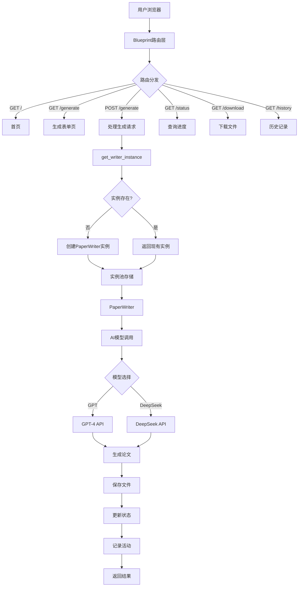

# PaperWriterRoutes Blueprint路由详解（完整版）

## 📋 目录

1. [项目概述](#项目概述)
2. [导入语句详解](#导入语句详解)
3. [日志配置详解](#日志配置详解)
4. [Blueprint创建详解](#blueprint创建详解)
5. [全局实例管理详解](#全局实例管理详解)
6. [路由详解](#路由详解)
7. [注册函数详解](#注册函数详解)
8. [技术总结](#技术总结)

---

## 📖 项目概述

`paper_writer_routes.py` 是**论文撰写系统的Blueprint路由模块**，使用Flask Blueprint实现模块化路由，集成多AI模型的论文自动生成功能。

### 主要功能

- 📝 **AI论文生成**: 基于GPT-4、DeepSeek等大语言模型的自动论文撰写
- 🔀 **多模型支持**: 支持多种AI模型提供商，可灵活切换
- 👥 **多用户隔离**: 每个用户维护独立的写作实例，互不干扰
- 📊 **实时进度追踪**: 通过session实现生成进度的实时查询
- 💾 **文件管理**: 安全的文件下载和历史记录管理
- 📜 **操作审计**: 记录用户的所有生成操作

### 系统架构图



### 文件统计

- **总行数**: 271行
- **导入模块**: 8个（Flask核心 + 业务逻辑 + 工具库）
- **路由数量**: 6个（首页、模板、生成、状态、下载、历史）
- **辅助函数**: 2个（get_writer_instance、register_routes）
- **支持模型**: 2个（GPT、DeepSeek，可扩展）
- **模型配置**: 硬编码API密钥（生产环境应使用环境变量）

### 核心技术特点

1. **Blueprint模块化**: URL前缀 `/paper-writer`，独立命名空间
2. **实例池模式**: 字典存储用户实例，避免重复创建
3. **双日志输出**: 同时记录到文件和控制台
4. **RESTful设计**: 符合REST规范的路由设计
5. **会话状态**: 使用Flask session追踪生成进度
6. **安全文件处理**: 路径验证、basename提取、白名单检查

---

## 📦 导入语句详解

### Flask核心模块导入（第1行）

```python
from flask import Blueprint, render_template, request, jsonify, session, current_app, send_from_directory  # 第1行
```

**第1行完整详解**：

```python
from flask import Blueprint, render_template, request, jsonify, session, current_app, send_from_directory

# from flask import
# Python导入语句，从flask包中导入多个组件

# Blueprint详解 ⭐⭐⭐⭐⭐
# 功能：创建模块化的Flask应用组件

# 什么是Blueprint？
# Blueprint是Flask提供的一种组织代码的方式
# 类似于"迷你应用"，可以包含：
# - 路由
# - 视图函数
# - 静态文件
# - 模板
# - 错误处理器

# 为什么使用Blueprint？
# 1. 代码组织：将相关功能分组到独立模块
# 2. 可重用性：Blueprint可以在多个应用中使用
# 3. 命名空间：避免路由名称冲突
# 4. 团队协作：不同成员开发不同模块
# 5. 延迟注册：Blueprint创建后可以稍后注册到应用

# Blueprint vs 直接在app中定义路由

# 传统方式（所有路由在app.py中）：
from flask import Flask
app = Flask(__name__)

@app.route('/paper-writer/')
def paper_writer_index():
    pass

@app.route('/paper-writer/generate')
def paper_writer_generate():
    pass

@app.route('/user/profile')
def user_profile():
    pass

# 问题：
# ✗ 所有路由混在一起
# ✗ 文件变得很长
# ✗ 难以维护
# ✗ 团队协作困难

# 使用Blueprint（推荐）：
# paper_writer_routes.py
from flask import Blueprint

paper_writer_bp = Blueprint('paper_writer', __name__, url_prefix='/paper-writer')

@paper_writer_bp.route('/')
def index():
    pass

@paper_writer_bp.route('/generate')
def generate():
    pass

# user_routes.py
user_bp = Blueprint('user', __name__, url_prefix='/user')

@user_bp.route('/profile')
def profile():
    pass

# app.py
app = Flask(__name__)
app.register_blueprint(paper_writer_bp)
app.register_blueprint(user_bp)

# 优势：
# ✓ 代码组织清晰
# ✓ 每个模块独立文件
# ✓ 易于维护和测试
# ✓ 支持团队并行开发

# Blueprint创建语法：
bp = Blueprint(
    'name',              # Blueprint名称
    __name__,            # 导入名称
    url_prefix='/prefix', # URL前缀（可选）
    template_folder='templates',  # 模板文件夹（可选）
    static_folder='static',       # 静态文件夹（可选）
    static_url_path='/static'     # 静态URL路径（可选）
)

# Blueprint路由定义：
@bp.route('/path')
def view_function():
    return "Hello"

# 实际URL：/prefix/path

# render_template详解 ⭐⭐⭐⭐⭐
# 功能：渲染Jinja2模板，返回HTML页面

# 基本用法：
return render_template('page.html')

# 传递变量：
return render_template('page.html', 
    username='张三', 
    age=25,
    items=['item1', 'item2']
)

# 模板文件查找路径：
# 1. 应用的templates文件夹
# 2. Blueprint的template_folder（如果指定）

# 示例项目结构：
"""
project/
├── app.py
├── templates/
│   ├── base.html
│   └── paper_writer/
│       ├── index.html
│       ├── generate.html
│       └── history.html
└── paper_writer_routes.py
"""

# 在paper_writer_routes.py中：
return render_template('paper_writer/index.html')
# 查找：templates/paper_writer/index.html

# Jinja2模板语法（在HTML中使用）：
"""
<!-- 变量 -->
<p>用户名：{{ username }}</p>

<!-- 条件 -->

    <p>管理员</p>

    <p>普通用户</p>


<!-- 循环 -->

    <li>{{ item }}</li>


<!-- 过滤器 -->
<p>{{ text|upper }}</p>  <!-- 转大写 -->
<p>{{ items|length }}</p> <!-- 列表长度 -->
"""

# request详解 ⭐⭐⭐⭐⭐
# 功能：访问HTTP请求的所有信息

# request对象的主要属性：
request.method       # HTTP方法：'GET', 'POST', 'PUT', 'DELETE'
request.args         # URL参数（查询字符串）：?key=value
request.form         # 表单数据（POST请求）
request.json         # JSON数据
request.files        # 上传的文件
request.headers      # HTTP请求头
request.cookies      # Cookie数据
request.path         # URL路径：'/paper-writer/generate'
request.url          # 完整URL：'http://localhost:5000/...'
request.remote_addr  # 客户端IP地址

# 使用示例：

# 1. 获取URL参数
# URL: /search?keyword=机器学习&page=2
keyword = request.args.get('keyword')  # '机器学习'
page = request.args.get('page', 1)     # '2'（默认值1）

# 2. 获取表单数据
# HTML: <form method="POST">
#         <input name="username">
#         <input name="password">
username = request.form.get('username')
password = request.form.get('password')

# 3. 获取JSON数据
# 前端发送：fetch('/api', {
#   method: 'POST',
#   headers: {'Content-Type': 'application/json'},
#   body: JSON.stringify({name: '张三', age: 25})
# })
data = request.json
name = data.get('name')  # '张三'
age = data.get('age')    # 25

# 4. 获取上传的文件
file = request.files.get('file')
if file:
    file.save('uploads/file.txt')

# 5. 判断请求方法
if request.method == 'POST':
    # 处理POST请求
    pass
elif request.method == 'GET':
    # 处理GET请求
    pass

# 6. 获取请求头
user_agent = request.headers.get('User-Agent')
content_type = request.headers.get('Content-Type')

# jsonify详解 ⭐⭐⭐⭐⭐
# 功能：将Python对象转换为JSON格式的HTTP响应

# 基本用法：
return jsonify({'success': True, 'message': '操作成功'})

# 自动设置响应头：
# Content-Type: application/json

# 支持的数据类型：
return jsonify({
    'string': 'hello',
    'number': 123,
    'float': 3.14,
    'boolean': True,
    'null': None,
    'list': [1, 2, 3],
    'dict': {'key': 'value'}
})

# 响应示例：
{
    "string": "hello",
    "number": 123,
    "float": 3.14,
    "boolean": true,
    "null": null,
    "list": [1, 2, 3],
    "dict": {"key": "value"}
}

# 带状态码的响应：
return jsonify({'error': '未找到'}), 404
return jsonify({'error': '权限不足'}), 403
return jsonify({'data': result}), 200

# jsonify vs json.dumps()
import json

# 方式1：使用jsonify（推荐）
return jsonify({'success': True})
# 优势：
# ✓ 自动设置Content-Type
# ✓ 返回Response对象
# ✓ 更简洁

# 方式2：使用json.dumps()
from flask import Response
return Response(
    json.dumps({'success': True}),
    mimetype='application/json'
)
# 缺点：
# ✗ 需要手动设置mimetype
# ✗ 代码更复杂

# 前端接收JSON：
"""
fetch('/api/data')
    .then(response => response.json())
    .then(data => {
        console.log(data.success);  // true
        console.log(data.message);  // '操作成功'
    });
"""

# session详解 ⭐⭐⭐⭐⭐
# 功能：在多个请求之间存储用户数据

# session vs cookie
# Cookie：
# - 存储在客户端（浏览器）
# - 可被用户查看和修改
# - 大小限制（4KB）
# - 不安全（明文传输）

# Session：
# - 数据存储在服务器端
# - 只有session_id存储在cookie中
# - session_id经过加密签名
# - 更安全
# - 需要secret_key

# Flask session实现：
# 实际上Flask的session是"客户端session"
# 数据加密后存储在cookie中
# 需要secret_key进行加密

# app.py配置：
app.secret_key = 'your-secret-key'  # 必须设置

# session基本操作：

# 1. 设置session
session['user_id'] = 123
session['username'] = '张三'
session['logged_in'] = True

# 2. 读取session
user_id = session.get('user_id')
username = session.get('username', 'guest')  # 带默认值

# 3. 检查键是否存在
if 'user_id' in session:
    print("用户已登录")

# 4. 删除特定键
session.pop('user_id', None)

# 5. 清空所有session
session.clear()

# session的生命周期：
# - 默认：浏览器关闭时失效
# - 可配置：permanent session（持久化）

# 设置永久session：
from datetime import timedelta
session.permanent = True
app.permanent_session_lifetime = timedelta(days=7)  # 7天后过期

# session安全性：
# ✓ 数据加密（使用secret_key）
# ✓ 签名验证（防止篡改）
# ✓ httponly标志（防止JS访问）
# ✗ 大小限制（4KB）
# ✗ 性能考虑（每次请求都传输）

# 本项目中session的使用：
# 1. 存储用户ID
session['user_id'] = user.id

# 2. 存储生成进度
session['paper_generation_status'] = {
    'started': True,
    'progress': 50,
    'message': '正在生成...'
}

# 3. 前端可以查询进度
# GET /status → 返回session['paper_generation_status']

# current_app详解 ⭐⭐⭐⭐
# 功能：访问当前Flask应用实例的代理对象

# 为什么需要current_app？
# Flask支持多个应用实例
# current_app总是指向当前请求的应用

# 使用场景：

# 1. 访问应用配置
from flask import current_app

config_value = current_app.config['SOME_CONFIG']
debug_mode = current_app.config['DEBUG']

# 2. 访问应用的logger
current_app.logger.info('日志消息')
current_app.logger.error('错误消息')

# 3. 在Blueprint中访问主应用
@bp.route('/config')
def show_config():
    db_uri = current_app.config['SQLALCHEMY_DATABASE_URI']
    return f"数据库：{db_uri}"

# 4. 应用上下文
# 某些操作需要应用上下文
with current_app.app_context():
    # 在此上下文中可以访问应用相关资源
    db.create_all()

# current_app vs app
# 在Blueprint中：
# ✗ 不能用：app（未定义）
# ✓ 应该用：current_app（代理对象）

# 原理：
# current_app是一个LocalProxy对象
# 自动指向当前请求的应用实例

# send_from_directory详解 ⭐⭐⭐⭐⭐
# 功能：安全地发送文件给客户端

# 基本用法：
return send_from_directory(
    directory='uploads',      # 文件所在目录
    path='file.pdf',          # 文件名
    as_attachment=True        # 是否强制下载
)

# 参数详解：

# directory：文件所在目录
# - 可以是相对路径或绝对路径
# - 函数会验证路径安全性

# path：文件名
# - 只能是文件名，不能包含路径
# - 如果包含路径，会被规范化

# as_attachment：下载行为
# - True：浏览器下载文件（Content-Disposition: attachment）
# - False：浏览器尝试打开文件（如PDF在浏览器中显示）

# 安全特性：

# 1. 防止路径遍历
# 恶意请求：/download/../../../etc/passwd
# send_from_directory会拒绝此类请求

# 2. MIME类型自动检测
# 根据文件扩展名设置正确的Content-Type
# .pdf → application/pdf
# .docx → application/vnd.openxmlformats-officedocument.wordprocessingml.document
# .json → application/json

# 3. 支持大文件
# 使用流式传输，不会一次性加载到内存

# 使用示例：

# 下载Word文档
return send_from_directory(
    'downloads',
    'paper.docx',
    as_attachment=True
)

# 在浏览器中显示PDF
return send_from_directory(
    'pdfs',
    'document.pdf',
    as_attachment=False
)

# 使用绝对路径
import os
return send_from_directory(
    os.path.join(os.getcwd(), 'files'),
    'data.json',
    as_attachment=True
)

# 错误处理：
try:
    return send_from_directory('uploads', filename)
except FileNotFoundError:
    return "文件不存在", 404

# 危险的做法（不要使用）：
# ✗ 直接读取文件
with open(file_path, 'rb') as f:
    return f.read()
# 问题：
# 1. 没有设置Content-Type
# 2. 没有Content-Disposition
# 3. 大文件会占用大量内存
# 4. 没有路径安全验证

# ✓ 安全的做法：
return send_from_directory(dir, filename, as_attachment=True)

# 导入总结：
# 这一行导入了Flask的7个核心组件
# 涵盖了Web开发的主要功能：
# ✓ Blueprint：模块化
# ✓ render_template：页面渲染
# ✓ request：请求数据
# ✓ jsonify：JSON响应
# ✓ session：会话管理
# ✓ current_app：应用访问
# ✓ send_from_directory：文件发送
```

### 业务逻辑模块导入（第2行）

```python
from paper_writer import PaperWriter               # 第2行
```

**第2行详解**：

```python
from paper_writer import PaperWriter

# 导入自定义模块
# paper_writer是本项目的核心业务模块

# PaperWriter类详解 ⭐⭐⭐⭐⭐
# 这是论文撰写系统的核心类
# 实现了基于AI的自动论文生成功能

# 主要功能：
# 1. 多智能体协作论文生成
# 2. AI模型API调用封装
# 3. 论文结构管理
# 4. 内容生成和优化
# 5. 多格式文件导出（DOCX、JSON）

# PaperWriter类的主要方法：
class PaperWriter:
    def __init__(self, api_key, base_url, model, model_provider):
        """初始化论文写作器"""
        pass
    
    def set_parameters(self, field, theme, scenario, problem, goal):
        """设置论文参数"""
        pass
    
    def set_language(self, language):
        """设置生成语言"""
        pass
    
    def generate_section(self, section_name):
        """生成指定部分"""
        # section_name: 'abstract', 'introduction', 'related_work', etc.
        pass
    
    def generate_full_paper(self):
        """生成完整论文"""
        # 调用多个generate_section()
        # 生成所有部分
        pass
    
    def save_to_docx(self, filename):
        """保存为Word文档"""
        # 使用python-docx库
        pass
    
    def export_to_json(self, filename):
        """导出为JSON格式"""
        # 便于数据交换和二次处理
        pass

# 使用示例：
writer = PaperWriter(
    api_key="sk-...",
    base_url="https://api.openai.com/v1",
    model="gpt-4",
    model_provider="gpt"
)

# 设置论文参数
writer.set_parameters(
    field="计算机科学",
    theme="深度学习",
    scenario="图像识别",
    problem="小样本学习准确率低",
    goal="提高小样本图像识别准确率"
)

# 生成完整论文
success = writer.generate_full_paper()

# 保存文件
if success:
    writer.save_to_docx("output.docx")
    writer.export_to_json("output.json")

# PaperWriter内部工作原理：
# 1. 参数设置阶段
#    - 存储用户输入的研究参数
#    - 构建prompt模板

# 2. 内容生成阶段
#    - 调用AI模型API
#    - 生成各个章节内容
#    - 多智能体协作优化

# 3. 文件导出阶段
#    - DOCX：使用python-docx库
#    - JSON：使用json库

# 多智能体协作：
# - Agent 1：摘要生成
# - Agent 2：引言撰写
# - Agent 3：相关工作综述
# - Agent 4：方法论设计
# - Agent 5：实验设计
# - Agent 6：结论总结

# 为什么在这里导入？
# 1. paper_writer_routes.py需要使用PaperWriter类
# 2. 创建用户的论文生成实例
# 3. 调用其方法进行论文生成

# 模块查找路径：
# 1. 当前目录
# 2. Python路径（sys.path）
# 3. 标准库路径

# 项目结构：
"""
project/
├── app.py
├── paper_writer.py          ← PaperWriter类定义
├── paper_writer_routes.py   ← 导入并使用PaperWriter
└── ...
"""
```

### 系统工具库导入（第3-5行）

```python
import os                                          # 第3行
import json                                        # 第4行
import logging                                     # 第5行
```

**第3-5行详解**：

```python
import os

# os模块详解 ⭐⭐⭐⭐⭐
# Python标准库，提供操作系统接口

# 在本项目中的应用：

# 1. 路径操作
os.path.join(dir1, dir2)       # 跨平台路径拼接
os.path.exists(path)           # 检查路径是否存在
os.path.basename(path)         # 提取文件名
os.path.dirname(path)          # 提取目录名
os.path.splitext(filename)     # 分离文件名和扩展名

# 2. 目录操作
os.listdir(path)               # 列出目录内容
os.makedirs(path)              # 创建目录（递归）
os.mkdir(path)                 # 创建目录（单层）

# 3. 文件信息
os.path.getsize(file)          # 获取文件大小
os.path.getctime(file)         # 获取创建时间
os.path.getmtime(file)         # 获取修改时间

# 4. 当前工作目录
os.getcwd()                    # 获取当前工作目录
os.chdir(path)                 # 改变当前工作目录

# 5. 系统相关
os.path.sep                    # 路径分隔符（Windows: '\\'，Linux: '/'）

# 本项目具体使用示例：

# 创建模板目录
template_dir = os.path.join(app.template_folder, 'paper_writer')
if not os.path.exists(template_dir):
    os.makedirs(template_dir)

# 安全处理文件名
if os.path.sep in filename or '/' in filename:
    filename = os.path.basename(filename)

# 构建文件路径
file_path = os.path.join(os.getcwd(), filename)

# 遍历目录查找文件
for file in os.listdir():
    if file.startswith('generated_paper_'):
        # 处理文件
        pass

import json

# json模块详解 ⭐⭐⭐⭐⭐
# Python标准库，处理JSON数据

# 主要函数：

# 1. json.dumps()
# Python对象 → JSON字符串
data = {'name': '张三', 'age': 25}
json_str = json.dumps(data)
# '{"name": "张三", "age": 25}'

# 带格式化
json_str = json.dumps(data, indent=2, ensure_ascii=False)
# {
#   "name": "张三",
#   "age": 25
# }

# 2. json.loads()
# JSON字符串 → Python对象
json_str = '{"name": "张三", "age": 25}'
data = json.loads(json_str)
# {'name': '张三', 'age': 25}

# 3. json.dump()
# Python对象 → JSON文件
with open('data.json', 'w', encoding='utf-8') as f:
    json.dump(data, f, indent=2, ensure_ascii=False)

# 4. json.load()
# JSON文件 → Python对象
with open('data.json', 'r', encoding='utf-8') as f:
    data = json.load(f)

# 本项目中的应用：

# 1. 接收JSON请求
data = request.json  # Flask自动调用json.loads()

# 2. 返回JSON响应
return jsonify(data)  # Flask自动调用json.dumps()

# 3. 导出论文数据
writer.export_to_json('paper.json')

# JSON vs Python类型映射：
# JSON          Python
# object        dict
# array         list
# string        str
# number (int)  int
# number (real) float
# true          True
# false         False
# null          None

import logging

# logging模块详解 ⭐⭐⭐⭐⭐
# Python标准库，日志记录系统

# 日志级别（从低到高）：
logging.DEBUG    # 10 - 详细的调试信息
logging.INFO     # 20 - 一般信息
logging.WARNING  # 30 - 警告信息
logging.ERROR    # 40 - 错误信息
logging.CRITICAL # 50 - 严重错误

# 基本用法：

# 1. 配置日志系统
logging.basicConfig(
    level=logging.INFO,
    format='%(asctime)s - %(levelname)s - %(message)s'
)

# 2. 记录日志
logging.debug('调试信息')
logging.info('一般信息')
logging.warning('警告信息')
logging.error('错误信息')
logging.critical('严重错误')

# 3. 创建logger
logger = logging.getLogger('my_app')
logger.info('使用自定义logger')

# 日志格式化字段：
# %(asctime)s    - 时间：2024-01-15 14:30:25,123
# %(levelname)s  - 级别：INFO, ERROR, etc.
# %(message)s    - 消息内容
# %(name)s       - logger名称
# %(filename)s   - 文件名
# %(lineno)d     - 行号
# %(funcName)s   - 函数名

# 日志处理器（Handlers）：

# 1. StreamHandler - 输出到控制台
handler1 = logging.StreamHandler()

# 2. FileHandler - 输出到文件
handler2 = logging.FileHandler('app.log')

# 3. 可以同时使用多个处理器
logging.basicConfig(
    handlers=[handler1, handler2]
)

# 本项目中的应用：
# 见第10-19行的详细配置

# logging vs print
# logging优势：
# ✓ 级别控制（可以过滤）
# ✓ 格式化输出
# ✓ 可以输出到文件
# ✓ 时间戳自动添加
# ✓ 可以在生产环境关闭DEBUG

# print缺点：
# ✗ 无法控制级别
# ✗ 无法输出到文件
# ✗ 没有时间戳
# ✗ 难以管理
```

### 数据库和工具导入（第6-8行）

```python
from models import db, User, UserActivity          # 第6行
import traceback                                   # 第7行
from datetime import datetime                      # 第8行
```

**第6-8行详解**：

```python
from models import db, User, UserActivity

# 从models模块导入数据库相关组件

# db详解
# SQLAlchemy数据库实例
# 在models.py中定义：db = SQLAlchemy()

# db的主要用途：
# 1. 会话管理
db.session.add(obj)       # 添加对象到会话
db.session.commit()       # 提交事务
db.session.rollback()     # 回滚事务
db.session.delete(obj)    # 删除对象

# 2. 数据库操作
db.create_all()           # 创建所有表
db.drop_all()             # 删除所有表

# User详解
# 用户模型类
# 字段：
# - id：主键
# - username：用户名
# - email：邮箱
# - password_hash：密码哈希
# - credits：积分
# - is_admin：是否管理员
# - created_at：创建时间

# User查询示例：
user = User.query.get(user_id)
user = User.query.filter_by(username='张三').first()
users = User.query.all()

# UserActivity详解
# 用户活动记录模型
# 字段：
# - id：主键
# - user_id：用户ID（外键）
# - activity_type：活动类型
# - credits_change：积分变动
# - description：描述
# - created_at：创建时间

# UserActivity使用示例：
activity = UserActivity(
    user_id=user.id,
    activity_type='paper_generation',
    description='生成论文：深度学习',
    credits_used=10
)
db.session.add(activity)
db.session.commit()

# 本项目中的应用：
# 记录用户的论文生成操作
# 用于审计和数据分析

import traceback

# traceback模块详解 ⭐⭐⭐⭐⭐
# Python标准库，异常追踪

# 主要功能：
# 获取详细的异常堆栈信息

# 主要方法：

# 1. traceback.format_exc()
# 返回完整的异常堆栈字符串
try:
    risky_operation()
except Exception as e:
    error_info = traceback.format_exc()
    print(error_info)

# 输出示例：
"""
Traceback (most recent call last):
  File "app.py", line 123, in generate
    writer.generate_full_paper()
  File "paper_writer.py", line 456, in generate_full_paper
    self.generate_section("introduction")
  File "paper_writer.py", line 789, in generate_section
    response = self.call_api()
  File "paper_writer.py", line 234, in call_api
    raise ValueError("API Error")
ValueError: API Error
"""

# 2. traceback.print_exc()
# 直接打印异常堆栈
try:
    risky_operation()
except:
    traceback.print_exc()

# str(e) vs traceback.format_exc()
# str(e)：只显示错误消息
# traceback.format_exc()：显示完整调用栈

# 示例对比：
try:
    result = 1 / 0
except Exception as e:
    print("str(e):", str(e))
    # "division by zero"
    
    print("traceback:")
    print(traceback.format_exc())
    # Traceback (most recent call last):
    #   File "test.py", line 2, in <module>
    #     result = 1 / 0
    # ZeroDivisionError: division by zero

# 为什么需要traceback？
# 1. 调试：定位错误发生的位置
# 2. 日志：记录完整的错误上下文
# 3. 问题排查：了解调用链

# 本项目中的应用：
logger.error(f"错误: {str(e)}")
logger.error(traceback.format_exc())

from datetime import datetime

# datetime模块详解 ⭐⭐⭐⭐⭐
# Python标准库，日期时间处理

# 主要类：
# - datetime.datetime：日期时间
# - datetime.date：日期
# - datetime.time：时间
# - datetime.timedelta：时间差

# datetime.datetime常用方法：

# 1. 获取当前时间
now = datetime.now()
# datetime(2024, 1, 15, 14, 30, 25, 123456)

utc_now = datetime.utcnow()
# UTC时间

# 2. 创建指定时间
dt = datetime(2024, 1, 15, 14, 30, 25)

# 3. 时间格式化
now.strftime('%Y-%m-%d %H:%M:%S')
# '2024-01-15 14:30:25'

now.strftime('%Y%m%d_%H%M%S')
# '20240115_143025'

# 4. 字符串解析
dt = datetime.strptime('2024-01-15', '%Y-%m-%d')

# 5. 时间戳转换
# datetime → 时间戳
timestamp = datetime.now().timestamp()
# 1705305025.123456

# 时间戳 → datetime
dt = datetime.fromtimestamp(1705305025)

# 6. 时间运算
from datetime import timedelta
tomorrow = datetime.now() + timedelta(days=1)
yesterday = datetime.now() - timedelta(days=1)
one_hour_later = datetime.now() + timedelta(hours=1)

# 格式化代码：
# %Y - 四位年份（2024）
# %y - 两位年份（24）
# %m - 月份（01-12）
# %d - 日期（01-31）
# %H - 小时（00-23）
# %M - 分钟（00-59）
# %S - 秒（00-59）
# %f - 微秒（000000-999999）

# 本项目中的应用：

# 1. 生成文件名时间戳
timestamp = datetime.now().strftime('%Y%m%d_%H%M%S')
filename = f"generated_paper_{user_id}_{timestamp}.docx"
# generated_paper_123_20240115_143025.docx

# 2. 格式化显示时间
created_time = datetime.fromtimestamp(
    os.path.getctime(file)
).strftime('%Y-%m-%d %H:%M:%S')
# '2024-01-15 14:30:25'

# 3. 数据库时间字段
created_at = db.Column(db.DateTime, default=datetime.utcnow)

# 导入总结：
# 第1行：Flask核心（7个组件）
# 第2行：业务逻辑（PaperWriter）
# 第3-5行：系统工具（os、json、logging）
# 第6-8行：数据库和工具（models、traceback、datetime）

# 共导入了8个模块/包
# 涵盖了Web开发的各个方面：
# ✓ Web框架
# ✓ 业务逻辑
# ✓ 文件操作
# ✓ 数据处理
# ✓ 日志记录
# ✓ 数据库ORM
# ✓ 异常处理
# ✓ 时间处理
```

---

## 📋 日志配置详解

### 日志系统配置（第10-19行）

```python
# 配置日志                                       # 第10行（注释）
logging.basicConfig(                            # 第11行
    level=logging.INFO,                         # 第12行
    format='%(asctime)s - %(levelname)s - %(message)s',  # 第13行
    handlers=[                                  # 第14行
        logging.FileHandler('paper_writer_routes.log'),  # 第15行
        logging.StreamHandler()                 # 第16行
    ]
)
logger = logging.getLogger('paper_writer_routes')  # 第19行
```

**第10-19行完整详解**：

```python
logging.basicConfig(
    level=logging.INFO,
    format='%(asctime)s - %(levelname)s - %(message)s',
    handlers=[
        logging.FileHandler('paper_writer_routes.log'),
        logging.StreamHandler()
    ]
)

# logging.basicConfig()详解 ⭐⭐⭐⭐⭐
# 功能：配置Python日志系统的基本设置

# 为什么需要配置日志？
# 1. 默认配置只输出WARNING及以上级别
# 2. 默认只输出到控制台
# 3. 默认格式简单，缺少时间戳

# level参数详解
level=logging.INFO

# 设置日志记录的最低级别

# 日志级别层次（从低到高）：
# DEBUG (10)    - 详细的调试信息
# INFO (20)     - 一般的信息消息
# WARNING (30)  - 警告消息
# ERROR (40)    - 错误消息
# CRITICAL (50) - 严重错误

# 级别过滤规则：
# 设置level=INFO时：
# ✓ INFO及以上会被记录（INFO, WARNING, ERROR, CRITICAL）
# ✗ DEBUG不会被记录

# 示例：
logger.debug("这条不会显示")     # ✗ DEBUG < INFO
logger.info("这条会显示")        # ✓ INFO = INFO
logger.warning("这条会显示")     # ✓ WARNING > INFO
logger.error("这条会显示")       # ✓ ERROR > INFO

# 为什么选择INFO级别？
# DEBUG：太详细，生产环境会产生大量日志
# INFO：适中，记录重要操作
# WARNING：太高，会遗漏很多信息

# 不同环境的级别建议：
# 开发环境：logging.DEBUG
# 测试环境：logging.INFO
# 生产环境：logging.WARNING 或 logging.INFO

# format参数详解
format='%(asctime)s - %(levelname)s - %(message)s'

# 定义日志输出的格式

# 格式化字段（所有可用字段）：
# %(asctime)s    - 时间戳
# %(created)f    - 创建时间（Unix时间戳）
# %(filename)s   - 文件名
# %(funcName)s   - 函数名
# %(levelname)s  - 日志级别名称
# %(levelno)d    - 日志级别数字
# %(lineno)d     - 行号
# %(message)s    - 日志消息
# %(module)s     - 模块名
# %(name)s       - logger名称
# %(pathname)s   - 完整路径
# %(process)d    - 进程ID
# %(processName)s - 进程名称
# %(thread)d     - 线程ID
# %(threadName)s - 线程名称

# 当前格式输出示例：
# 2024-01-15 14:30:25,123 - INFO - 用户123开始生成论文

# 其他常用格式示例：

# 简洁格式：
format='%(levelname)s: %(message)s'
# INFO: 用户123开始生成论文

# 详细格式：
format='%(asctime)s - %(name)s - %(levelname)s - %(filename)s:%(lineno)d - %(message)s'
# 2024-01-15 14:30:25 - paper_writer - INFO - routes.py:123 - 用户123开始生成论文

# 带函数名的格式：
format='[%(asctime)s] %(levelname)s in %(funcName)s: %(message)s'
# [2024-01-15 14:30:25] INFO in generate: 用户123开始生成论文

# 时间格式自定义：
# basicConfig还支持datefmt参数
logging.basicConfig(
    format='%(asctime)s - %(message)s',
    datefmt='%Y-%m-%d %H:%M:%S'
)
# 2024-01-15 14:30:25 - 用户123开始生成论文

# handlers参数详解 ⭐⭐⭐⭐⭐
handlers=[
    logging.FileHandler('paper_writer_routes.log'),
    logging.StreamHandler()
]

# 处理器（Handler）：
# 决定日志输出到哪里

# 常见处理器类型：

# 1. FileHandler - 输出到文件
file_handler = logging.FileHandler('app.log')
# 默认模式：'a'（追加）
# 其他模式：'w'（覆盖）

# 完整参数：
file_handler = logging.FileHandler(
    filename='app.log',
    mode='a',              # 追加模式
    encoding='utf-8',      # 文件编码
    delay=False            # 立即创建文件
)

# 2. StreamHandler - 输出到控制台
stream_handler = logging.StreamHandler()
# 默认输出到sys.stderr

# 指定输出流：
import sys
stream_handler = logging.StreamHandler(sys.stdout)

# 3. RotatingFileHandler - 轮转文件
from logging.handlers import RotatingFileHandler
rotating_handler = RotatingFileHandler(
    filename='app.log',
    maxBytes=10*1024*1024,  # 10MB
    backupCount=5           # 保留5个备份
)
# 当日志文件达到10MB时，自动创建新文件
# app.log → app.log.1 → app.log.2 → ...

# 4. TimedRotatingFileHandler - 按时间轮转
from logging.handlers import TimedRotatingFileHandler
timed_handler = TimedRotatingFileHandler(
    filename='app.log',
    when='midnight',        # 每天午夜轮转
    interval=1,             # 间隔1天
    backupCount=7           # 保留7天
)

# 为什么使用多个处理器？
# 1. FileHandler：持久化存储，便于事后分析
# 2. StreamHandler：实时查看，便于开发调试

# 日志会同时输出到两个地方：
# ✓ 文件：paper_writer_routes.log
# ✓ 控制台：终端窗口

# 文件日志的优势：
# ✓ 永久保存
# ✓ 可以查看历史
# ✓ 便于问题排查
# ✓ 支持日志分析工具

# 控制台日志的优势：
# ✓ 实时反馈
# ✓ 开发时方便
# ✓ 无需打开文件

# 处理器的级别设置：
# 每个处理器可以有自己的级别
file_handler = logging.FileHandler('app.log')
file_handler.setLevel(logging.DEBUG)  # 文件记录所有

stream_handler = logging.StreamHandler()
stream_handler.setLevel(logging.WARNING)  # 控制台只显示警告

# 日志文件示例内容：
"""
paper_writer_routes.log:
----------------------------------------
2024-01-15 14:30:25,123 - INFO - 创建PaperWriter实例，用户: 123, 模型提供商: gpt
2024-01-15 14:30:30,456 - INFO - 用户 123 选择使用 gpt 模型生成论文
2024-01-15 14:35:45,789 - ERROR - 论文生成错误: API timeout
2024-01-15 14:35:45,790 - ERROR - Traceback (most recent call last):
  File "routes.py", line 152, in generate
    success = writer.generate_full_paper()
  ...
"""

# logger = logging.getLogger('paper_writer_routes')
# 创建命名logger实例

logger = logging.getLogger('paper_writer_routes')

# logging.getLogger()详解
# 功能：获取或创建一个logger实例

# logger层次结构：
# root logger (根logger)
#   ├── app
#   ├── paper_writer_routes  ← 本项目
#   ├── database
#   └── utils

# 为什么使用命名logger？
# 1. 区分不同模块的日志
# 2. 可以为不同模块设置不同级别
# 3. 便于日志过滤和分析

# logger vs root logger
# root logger：
logger = logging.getLogger()  # 或 logging.root
# 所有未指定名称的日志

# 命名logger：
logger = logging.getLogger('my_module')
# 特定模块的日志

# logger的使用：
logger.debug('调试信息')
logger.info('一般信息')
logger.warning('警告信息')
logger.error('错误信息')
logger.critical('严重错误')

# 带参数的日志：
logger.info('用户 %s 执行了 %s 操作', user_id, action)
logger.error('错误代码: %d', error_code)

# f-string格式化（推荐）：
logger.info(f'用户 {user_id} 执行了 {action} 操作')

# logger vs logging直接调用
# 方式1：使用logger（推荐）
logger = logging.getLogger('my_app')
logger.info('消息')

# 方式2：直接调用logging
logging.info('消息')

# 推荐使用logger的原因：
# ✓ 可以设置模块特定的级别
# ✓ 日志中包含模块名称
# ✓ 更灵活的配置

# 完整的日志配置流程：
# 1. 配置基本设置（level, format, handlers）
logging.basicConfig(...)

# 2. 创建logger实例
logger = logging.getLogger('paper_writer_routes')

# 3. 在代码中使用
logger.info("论文撰写系统路由已注册")

# 日志最佳实践：
# ✓ 使用适当的日志级别
# ✓ 提供清晰的日志消息
# ✓ 包含关键上下文信息
# ✓ 敏感信息脱敏（如API密钥）
# ✓ 记录异常的完整堆栈

# 本项目的日志策略：
# INFO：用户操作、系统状态
logger.info(f"用户 {user_id} 开始生成论文")

# ERROR：操作失败、异常
logger.error(f"论文生成错误: {str(e)}")
logger.error(traceback.format_exc())

# 敏感信息脱敏：
logger.info(f"API密钥: {api_key[:10]}...")  # 只显示前10个字符

# 日志配置总结：
# 1. 级别：INFO（平衡详细度和性能）
# 2. 格式：时间 - 级别 - 消息
# 3. 双输出：文件 + 控制台
# 4. 命名logger：paper_writer_routes

# 这样的配置可以：
# ✓ 记录重要操作
# ✓ 便于问题排查
# ✓ 实时监控
# ✓ 持久化存储
```

---

由于文档内容非常长，让我继续创建剩余部分。我将分多个部分完成这个超详细的文档...
