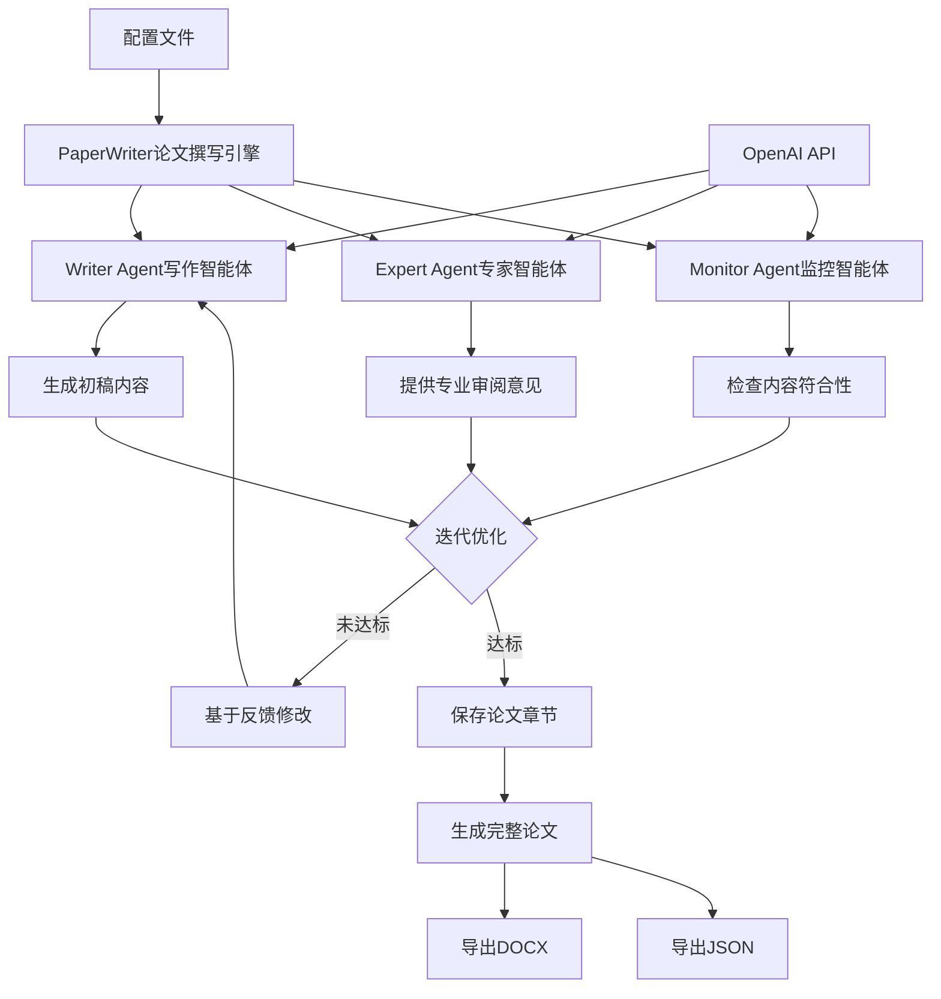

# PaperWriter AI论文生成系统详解

## 📋 目录

1. [项目概述](#项目概述)
2. [导入语句详解](#导入语句详解)
3. [日志配置详解](#日志配置详解)
4. [PaperWritingAgent智能体类](#paperwritingagent智能体类)
5. [PaperWriter论文撰写引擎](#paperwriter论文撰写引擎)
6. [测试函数](#测试函数)
7. [技术总结](#技术总结)

---

## 📖 项目概述

`paper_writer.py` 是**基于多智能体协作的AI论文自动生成系统**，使用大语言模型（GPT-4、DeepSeek等）实现学术论文的智能化撰写。

### 主要功能

- 🤖 **多智能体协作**: 写作、专家审阅、监控三个智能体协同工作
- 📝 **论文生成**: 自动生成完整的学术论文各个章节
- 🔄 **迭代优化**: 基于专家反馈迭代改进内容质量
- 💾 **多格式导出**: 支持Word（DOCX）和JSON格式输出
- 🌍 **多语言支持**: 支持中文和英文论文生成
- 🎛️ **灵活配置**: 支持多种AI模型提供商

### 系统架构图



### 核心设计思想

1. **多智能体协作**：
   - Writer Agent：负责内容生成
   - Expert Agent：提供专业审阅
   - Monitor Agent：监控偏离度

2. **迭代优化机制**：
   - 最多3次迭代
   - 基于反馈不断改进
   - 达到质量标准后停止

3. **模块化设计**：
   - 智能体类独立封装
   - 论文生成引擎分离
   - 配置文件外部化

### 文件统计

- **总行数**: 410行
- **导入模块**: 7个
- **类数量**: 2个（PaperWritingAgent、PaperWriter）
- **方法数量**: 13个
- **支持模型**: GPT-4、DeepSeek（可扩展）
- **论文章节**: 8个标准章节

---

## 📦 导入语句详解（第1-8行）

```python
from openai import OpenAI                      # 第1行
import os                                      # 第2行
import json                                    # 第3行
import time                                    # 第4行
from docx import Document                      # 第5行
import re                                      # 第6行
from datetime import datetime                  # 第7行
import logging                                 # 第8行
```

### 第1行：OpenAI SDK导入 ⭐⭐⭐⭐⭐

```python
from openai import OpenAI

# OpenAI官方Python SDK详解
# 功能：调用OpenAI API（GPT-4等大语言模型）

# 安装：
# pip install openai

# 基本使用：
from openai import OpenAI

client = OpenAI(
    api_key="sk-...",
    base_url="https://api.openai.com/v1"  # 可选，自定义端点
)

# 调用聊天接口：
response = client.chat.completions.create(
    model="gpt-4",
    messages=[
        {"role": "system", "content": "你是一个学术助手"},
        {"role": "user", "content": "帮我写一篇论文"}
    ]
)

# 获取回复：
reply = response.choices[0].message.content
print(reply)

# OpenAI API的消息格式：
messages = [
    {
        "role": "system",      # 系统指令
        "content": "你是..."   # 定义AI的角色和行为
    },
    {
        "role": "user",        # 用户消息
        "content": "..."       # 用户的问题或要求
    },
    {
        "role": "assistant",   # AI回复
        "content": "..."       # AI的回答
    }
]

# role类型说明：
# - system：系统指令，设置AI的行为模式
# - user：用户输入，提出问题或要求
# - assistant：AI回复，历史对话中AI的回答

# 本项目支持多个API提供商：
# 1. OpenAI官方（GPT-4）
client = OpenAI(
    api_key="sk-...",
    base_url="https://api.openai.com/v1"
)

# 2. OpenAI兼容接口（如chat01.ai）
client = OpenAI(
    api_key="sk-...",
    base_url="https://chat01.ai/v1"
)

# 3. DeepSeek
client = OpenAI(
    api_key="sk-...",
    base_url="https://api.deepseek.com"
)

# API调用参数详解：
response = client.chat.completions.create(
    model="gpt-4",           # 模型名称
    messages=messages,       # 对话消息列表
    temperature=0.7,         # 创造性（0-2，默认1）
    max_tokens=2000,         # 最大生成token数
    top_p=1.0,              # 采样参数
    frequency_penalty=0,     # 频率惩罚（-2到2）
    presence_penalty=0,      # 存在惩罚（-2到2）
    stream=False            # 是否流式输出
)

# temperature参数：
# - 0：最确定性，输出固定
# - 0.7：平衡创造性和确定性（常用）
# - 1.5：高创造性，输出多样

# 响应对象结构：
response = {
    "id": "chatcmpl-...",
    "object": "chat.completion",
    "created": 1677652288,
    "model": "gpt-4",
    "choices": [
        {
            "index": 0,
            "message": {
                "role": "assistant",
                "content": "AI的回复内容"
            },
            "finish_reason": "stop"
        }
    ],
    "usage": {
        "prompt_tokens": 100,
        "completion_tokens": 50,
        "total_tokens": 150
    }
}

# 错误处理：
from openai import OpenAIError

try:
    response = client.chat.completions.create(...)
except OpenAIError as e:
    print(f"API错误: {str(e)}")

# 流式输出：
response = client.chat.completions.create(
    model="gpt-4",
    messages=messages,
    stream=True  # 启用流式
)

for chunk in response:
    if chunk.choices[0].delta.content:
        print(chunk.choices[0].delta.content, end='')
```

### 第2-8行：其他依赖库

```python
import os

# os模块：操作系统接口
# 本项目用途：
# - 文件路径处理
# - 获取绝对路径
os.path.abspath(filename)

import json

# json模块：JSON数据处理
# 本项目用途：
# 1. 读取配置文件
with open('config.json', 'r') as f:
    config = json.load(f)

# 2. 保存论文数据
with open('paper.json', 'w') as f:
    json.dump(data, f, ensure_ascii=False, indent=2)

import time

# time模块：时间处理
# 本项目中可能用于：
# - 延时重试
# - 性能测试
time.sleep(1)  # 暂停1秒

from docx import Document

# python-docx库：Word文档处理 ⭐⭐⭐⭐⭐
# 功能：创建和编辑Word文档

# 安装：
# pip install python-docx

# 基本使用：
from docx import Document

# 创建新文档
doc = Document()

# 添加标题
doc.add_heading('论文标题', level=0)  # 最高级标题
doc.add_heading('第一章', level=1)    # 一级标题
doc.add_heading('1.1 小节', level=2)  # 二级标题

# 添加段落
doc.add_paragraph('这是一段文字')

# 添加带样式的段落
doc.add_paragraph('重要文字', style='IntenseQuote')

# 保存文档
doc.save('output.docx')

# 本项目使用示例：
doc = Document()
doc.add_heading(f"{field}-{theme} 研究论文", level=0)
doc.add_heading("研究背景", level=1)
doc.add_paragraph("背景内容...")
doc.save("paper.docx")

import re

# re模块：正则表达式
# 本项目可能用于：
# - 文本清理
# - 格式提取
pattern = re.compile(r'\d+')
matches = pattern.findall(text)

from datetime import datetime

# datetime模块：日期时间处理
# 本项目用途：
# 1. 生成时间戳
timestamp = datetime.now().strftime('%Y%m%d_%H%M%S')
# '20240115_143025'

# 2. 记录生成时间
generation_time = datetime.now().strftime('%Y-%m-%d %H:%M:%S')
# '2024-01-15 14:30:25'

import logging

# logging模块：日志记录
# 详见第10-19行的日志配置
```

---

## 📋 日志配置详解（第10-19行）

```python
# 配置日志                                       # 第10行（注释）
logging.basicConfig(                            # 第11行
    level=logging.INFO,                         # 第12行
    format='%(asctime)s - %(levelname)s - %(message)s',  # 第13行
    handlers=[                                  # 第14行
        logging.FileHandler('paper_writer.log'),  # 第15行
        logging.StreamHandler()                 # 第16行
    ]
)
logger = logging.getLogger('paper_writer')      # 第19行

# 日志配置说明（与paper_writer_routes.py类似）

# level=logging.INFO
# 记录级别：INFO及以上

# format格式：
# 2024-01-15 14:30:25,123 - INFO - 消息内容

# 双输出：
# 1. paper_writer.log文件
# 2. 控制台

# logger使用示例：
logger.info("开始生成论文")
logger.error(f"API调用错误: {str(e)}")
logger.warning(f"不支持的语言: {language}")

# 日志输出示例：
"""
2024-01-15 14:30:25 - INFO - 初始化智能体 writer, 模型: gpt-4.5-preview
2024-01-15 14:30:26 - INFO - 开始生成论文部分: background
2024-01-15 14:30:30 - INFO - writer 智能体接收提示: 请生成研究背景部分...
2024-01-15 14:30:45 - INFO - writer 智能体回复: 在人工智能快速发展的今天...
2024-01-15 14:35:50 - INFO - 部分 background 生成完成，共 2 次迭代
"""
```

---

## 🤖 PaperWritingAgent智能体类

### 类定义和初始化（第21-67行）

```python
class PaperWritingAgent:                        # 第21行
    """单个智能体类，用于与LLM交互"""            # 第22行
    
    def __init__(self, role, instructions, api_key=None, model="gpt-4.5-preview", 
                 base_url="https://chat01.ai/v1", model_provider="gpt"):  # 第24行
        """初始化智能体"""
        self.role = role                        # 第26行
        self.instructions = instructions        # 第27行
```

**第21-27行详解**：

```python
class PaperWritingAgent:
    """单个智能体类，用于与LLM交互"""

# 智能体类设计
# 作用：封装与大语言模型的交互逻辑

# 什么是智能体（Agent）？
# 智能体是一个具有特定角色和功能的AI实例
# 可以：
# - 理解指令
# - 执行任务
# - 保持对话历史
# - 提供专业反馈

# 本系统的三个智能体：
# 1. Writer Agent（写作智能体）
#    - 角色：论文撰写者
#    - 任务：生成论文内容

# 2. Expert Agent（专家智能体）
#    - 角色：学术专家
#    - 任务：审阅并提供改进建议

# 3. Monitor Agent（监控智能体）
#    - 角色：质量监控
#    - 任务：检查内容是否符合要求

def __init__(self, role, instructions, api_key=None, model="gpt-4.5-preview", 
             base_url="https://chat01.ai/v1", model_provider="gpt"):

# 参数详解：

# role: 智能体角色
# 值："writer", "expert", "monitor"
# 作用：标识智能体身份，用于日志记录

# instructions: 系统指令
# 类型：字符串
# 作用：定义智能体的行为模式
# 示例：
"""
你是一位经验丰富的学术论文撰写专家。
你的任务是生成高质量的学术论文内容。
要求：
1. 内容准确、逻辑清晰
2. 符合学术规范
3. 语言专业流畅
"""

# api_key: API密钥
# 默认值：None
# 如果为None，使用配置中的默认密钥

# model: 模型名称
# 默认值："gpt-4.5-preview"
# 可选：
# - "gpt-4"
# - "gpt-3.5-turbo"
# - "deepseek-chat"

# base_url: API端点
# 默认值："https://chat01.ai/v1"
# 可选：
# - "https://api.openai.com/v1"（OpenAI官方）
# - "https://api.deepseek.com"（DeepSeek）

# model_provider: 模型提供商
# 默认值："gpt"
# 可选："gpt", "deepseek"
# 作用：选择预设的配置

# self.role = role
# 保存角色名称

# self.instructions = instructions
# 保存系统指令
# 用于每次API调用时设置AI的行为模式
```

### 模型配置（第29-53行）

```python
# 默认配置 - 支持多个模型提供商            # 第29行（注释）
default_configs = {                         # 第30行
    "gpt": {                                # 第31行
        "api_key": "sk-VO4yKA1bIncBuC1TKM8jpQlROLAqcRx0CDlODqkLcffDhdRo",  # 第32行
        "base_url": "https://chat01.ai/v1",  # 第33行
        "model": "gpt-4.5-preview"          # 第34行
    },
    "deepseek": {                           # 第36行
        "api_key": "sk-771cca9e3f9e489e9ea1f5fb9f800a2f",  # 第37行
        "base_url": "https://api.deepseek.com",  # 第38行
        "model": "deepseek-chat"            # 第39行
    }
}

# 设置模型配置                              # 第43行（注释）
if model_provider in default_configs:       # 第44行
    config = default_configs[model_provider]  # 第45行
    self.api_key = api_key if api_key else config["api_key"]  # 第46行
    self.model = model if model != "gpt-4.5-preview" else config["model"]  # 第47行
    self.base_url = base_url if base_url != "https://chat01.ai/v1" else config["base_url"]  # 第48行
else:                                       # 第49行
    self.api_key = api_key if api_key else default_configs["gpt"]["api_key"]  # 第50行
    self.model = model                      # 第51行
    self.base_url = base_url                # 第52行
```

**模型配置详解**：

```python
# 多模型配置字典
default_configs = {
    "gpt": {...},
    "deepseek": {...}
}

# 为什么需要多模型支持？
# 1. 成本考虑：DeepSeek更便宜
# 2. 性能对比：不同模型各有优势
# 3. 备份方案：主模型不可用时切换

# 配置选择逻辑：
if model_provider in default_configs:
    # 使用预设配置
    config = default_configs[model_provider]
else:
    # 使用自定义配置

# 参数优先级：
# 用户传入参数 > 预设配置 > 默认值

# 示例1：使用默认GPT配置
agent = PaperWritingAgent(
    role="writer",
    instructions="...",
    model_provider="gpt"
)
# 结果：
# api_key = "sk-VO4yKA..."
# model = "gpt-4.5-preview"
# base_url = "https://chat01.ai/v1"

# 示例2：使用DeepSeek
agent = PaperWritingAgent(
    role="writer",
    instructions="...",
    model_provider="deepseek"
)
# 结果：
# api_key = "sk-771cca..."
# model = "deepseek-chat"
# base_url = "https://api.deepseek.com"

# 示例3：自定义配置
agent = PaperWritingAgent(
    role="writer",
    instructions="...",
    api_key="my-custom-key",
    model="gpt-4",
    base_url="https://my-api.com/v1"
)

# 三元表达式详解：
self.api_key = api_key if api_key else config["api_key"]

# 等价于：
if api_key:
    self.api_key = api_key
else:
    self.api_key = config["api_key"]

# 逻辑：
# - 如果用户提供了api_key，使用用户的
# - 否则，使用配置中的默认值

# 注意：实际项目中不应硬编码API密钥
# 推荐做法：
import os
api_key = os.getenv('OPENAI_API_KEY')

# 或使用配置文件：
with open('config.json') as f:
    config = json.load(f)
    api_key = config['api_key']
```

### OpenAI客户端初始化（第54-67行）

```python
self.model_provider = model_provider        # 第54行
self.history = []                           # 第55行

# 调试信息                                   # 第57行（注释）
logger.info(f"初始化智能体 {role}, 模型: {self.model}, API密钥: {self.api_key[:10]}...")  # 第58行

# 初始化OpenAI客户端                         # 第60行（注释）
if not self.api_key:                        # 第61行
    raise ValueError("API密钥不能为空")       # 第62行
    
self.client = OpenAI(                       # 第64行
    api_key=self.api_key,                   # 第65行
    base_url=self.base_url                  # 第66行
)
```

**客户端初始化详解**：

```python
self.history = []

# 对话历史列表
# 存储与AI的历史对话
# 结构：
self.history = [
    {"role": "user", "content": "第一个问题"},
    {"role": "assistant", "content": "第一个回答"},
    {"role": "user", "content": "第二个问题"},
    {"role": "assistant", "content": "第二个回答"}
]

# 为什么需要历史记录？
# 1. 上下文连贯：AI能理解之前的对话
# 2. 多轮对话：支持迭代优化
# 3. 提高质量：基于历史生成更好的内容

# 日志记录：
logger.info(f"初始化智能体 {role}, 模型: {self.model}, API密钥: {self.api_key[:10]}...")

# 输出示例：
# 2024-01-15 14:30:25 - INFO - 初始化智能体 writer, 模型: gpt-4.5-preview, API密钥: sk-VO4yKA1...

# 为什么只显示前10个字符？
# 安全考虑：防止完整密钥泄露到日志

# API密钥验证：
if not self.api_key:
    raise ValueError("API密钥不能为空")

# raise关键字：
# 功能：抛出异常，中断程序执行
# ValueError：值错误异常
# 作用：参数验证，确保必要参数存在

# 创建OpenAI客户端：
self.client = OpenAI(
    api_key=self.api_key,
    base_url=self.base_url
)

# OpenAI客户端详解：
client = OpenAI(
    api_key="sk-...",       # API密钥（必需）
    base_url="https://...", # API端点（可选）
    timeout=60,             # 超时时间（可选）
    max_retries=3          # 最大重试次数（可选）
)

# 使用客户端调用API：
response = client.chat.completions.create(
    model="gpt-4",
    messages=[...]
)
```

### 智能体调用方法（第69-108行）⭐核心方法

```python
def __call__(self, prompt, system_message=None):  # 第69行
    """执行智能体对话，返回回复"""
    messages = []                               # 第71行
    
    # 添加系统指令                             # 第73行（注释）
    if system_message:                          # 第74行
        messages.append({"role": "system", "content": system_message})  # 第75行
    else:                                       # 第76行
        messages.append({"role": "system", "content": self.instructions})  # 第77行
        
    # 添加历史对话                             # 第79行（注释）
    messages.extend(self.history)               # 第80行
    
    # 添加当前提示                             # 第82行（注释）
    messages.append({"role": "user", "content": prompt})  # 第83行
```

**__call__方法详解**：

```python
def __call__(self, prompt, system_message=None):

# __call__魔法方法详解 ⭐⭐⭐⭐⭐
# 功能：使对象可以像函数一样被调用

# 普通调用：
agent.generate("写一篇文章")  # 需要定义generate方法

# 使用__call__：
agent("写一篇文章")  # 直接调用对象

# 示例：
class Agent:
    def __call__(self, prompt):
        return f"处理: {prompt}"

agent = Agent()
result = agent("任务")  # 调用__call__方法
print(result)  # "处理: 任务"

# 等价于：
result = agent.__call__("任务")

# 在本项目中的使用：
writer_agent = PaperWritingAgent(role="writer", ...)
content = writer_agent("请生成研究背景")  # 调用__call__

# 参数说明：
# prompt: 用户提示词（问题或要求）
# system_message: 临时系统指令（可选）

# 构建消息列表：
messages = []

# 1. 添加系统指令
if system_message:
    # 使用临时指令
    messages.append({"role": "system", "content": system_message})
else:
    # 使用初始化时的默认指令
    messages.append({"role": "system", "content": self.instructions})

# 2. 添加历史对话
messages.extend(self.history)

# extend() vs append()
# extend()：添加列表中的所有元素
list1 = [1, 2]
list1.extend([3, 4])  # [1, 2, 3, 4]

# append()：添加整个列表作为一个元素
list2 = [1, 2]
list2.append([3, 4])  # [1, 2, [3, 4]]

# 3. 添加当前提示
messages.append({"role": "user", "content": prompt})

# 最终messages结构：
messages = [
    {"role": "system", "content": "系统指令"},
    {"role": "user", "content": "历史问题1"},
    {"role": "assistant", "content": "历史回答1"},
    {"role": "user", "content": "历史问题2"},
    {"role": "assistant", "content": "历史回答2"},
    {"role": "user", "content": "当前问题"}
]

# 为什么这样组织消息？
# 1. system在最前：设置AI角色
# 2. 中间是历史：提供上下文
# 3. 最后是新问题：AI基于上下文回答
```

### API调用和响应处理（第85-108行）

```python
try:                                        # 第85行
    logger.info(f"{self.role} 智能体接收提示: {prompt[:100]}...")  # 第86行
    response = self.client.chat.completions.create(  # 第87行
        model=self.model,                   # 第88行
        messages=messages,                  # 第89行
        stream=False                        # 第90行
    )
    
    reply = response.choices[0].message.content  # 第93行
    
    # 更新历史                               # 第95行（注释）
    self.history.append({"role": "user", "content": prompt})  # 第96行
    self.history.append({"role": "assistant", "content": reply})  # 第97行
    
    # 保持历史长度合理                       # 第99行（注释）
    if len(self.history) > 10:              # 第100行
        self.history = self.history[-10:]   # 第101行
        
    logger.info(f"{self.role} 智能体回复: {reply[:100]}...")  # 第103行
    return reply                            # 第104行
        
except Exception as e:                      # 第106行
    logger.error(f"API调用错误: {str(e)}")   # 第107行
    return f"错误: {str(e)}"                 # 第108行
```

**API调用详解**：

```python
# API调用：
response = self.client.chat.completions.create(
    model=self.model,      # 使用的模型
    messages=messages,     # 对话消息
    stream=False          # 非流式输出
)

# stream参数：
# False：等待完整回复后返回
# True：逐字返回（流式输出）

# 流式输出示例：
response = client.chat.completions.create(
    model="gpt-4",
    messages=[...],
    stream=True  # 启用流式
)

for chunk in response:
    content = chunk.choices[0].delta.content
    if content:
        print(content, end='')  # 逐字打印

# 提取回复内容：
reply = response.choices[0].message.content

# response结构：
{
    "choices": [
        {
            "index": 0,
            "message": {
                "role": "assistant",
                "content": "AI的回复内容在这里"
            },
            "finish_reason": "stop"
        }
    ]
}

# choices[0]：第一个选择（通常只有一个）
# message.content：AI的回复文本

# 更新对话历史：
self.history.append({"role": "user", "content": prompt})
self.history.append({"role": "assistant", "content": reply})

# 历史长度管理：
if len(self.history) > 10:
    self.history = self.history[-10:]

# 为什么限制历史长度？
# 1. API有token限制（如GPT-4最多8192）
# 2. 过长历史影响性能
# 3. 远期历史对当前对话帮助不大

# 切片操作[-10:]：
# 保留最后10个元素
history = [1, 2, 3, 4, 5, 6, 7, 8, 9, 10, 11, 12]
history[-10:]  # [3, 4, 5, 6, 7, 8, 9, 10, 11, 12]

# 异常处理：
except Exception as e:
    logger.error(f"API调用错误: {str(e)}")
    return f"错误: {str(e)}"

# 可能的错误：
# 1. 网络错误
# 2. API密钥无效
# 3. 请求超时
# 4. 模型不存在
# 5. token超限

# 返回错误信息而不是抛出异常
# 优势：
# - 程序继续运行
# - 用户看到友好提示
# - 便于调试
```

### 重置历史方法（第110-112行）

```python
def reset_history(self):                    # 第110行
    """重置对话历史"""
    self.history = []                       # 第112行

# 用途：
# 1. 开始新话题时清空历史
# 2. 防止上下文混淆
# 3. 节省token

# 使用示例：
agent = PaperWritingAgent(...)
agent("第一个问题")
agent("第二个问题")
# self.history有4条记录（2个问题+2个回答）

agent.reset_history()
# self.history = []，清空历史

agent("新的问题")
# 不受之前对话影响
```

---

由于文档内容非常长，让我继续创建PaperWriter类的详解部分...
