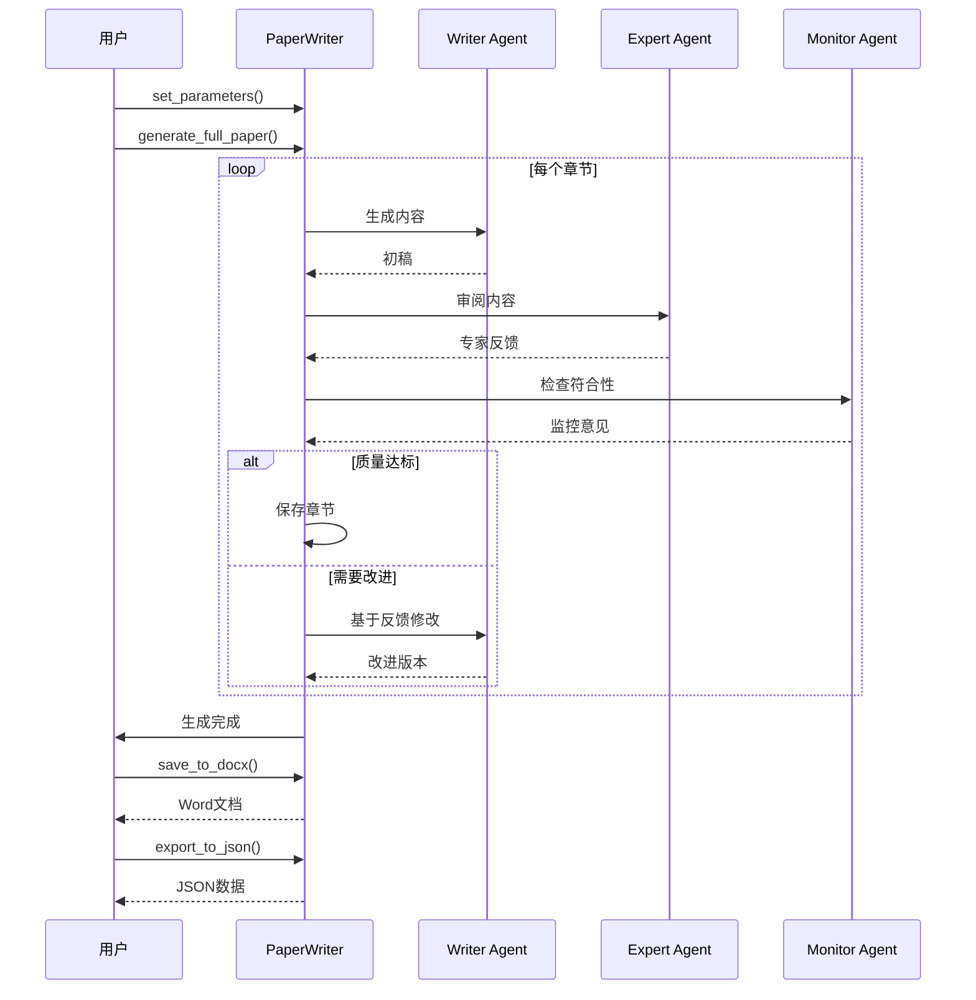

# PaperWriter 导出和测试详解（补充文档3）

本文档是 `PaperWriter_AI论文生成系统详解.md` 系列的最后一部分，讲解论文生成、文件导出和测试功能。

---

## 📄 完整论文生成方法

### generate_full_paper方法（第302-332行）⭐⭐⭐⭐⭐

```python
def generate_full_paper(self):              # 第302行
    """生成完整论文"""
    logger.info("开始生成完整论文")          # 第304行
    
    # 检查必要参数                           # 第306行（注释）
    required_params = ["field", "theme", "scenario", "problem", "goal"]  # 第307行
    for param in required_params:           # 第308行
        if not self.current_parameters.get(param):  # 第309行
            logger.error(f"缺少必要参数: {param}")  # 第310行
            return False                    # 第311行
            
    # 按顺序生成各部分                       # 第313行（注释）
    for section in self.config['workflow']['section_order']:  # 第314行
        success = self.generate_section(section)  # 第315行
        if not success:                     # 第316行
            logger.error(f"生成部分 {section} 失败")  # 第317行
            return False                    # 第318行
            
        # 如果是前几部分生成后，可能需要更新后续部分的参数  # 第320行（注释）
        if section == "solution_approach" and not self.current_parameters.get("method"):  # 第321行
            # 从生成的内容中提取方法信息      # 第322行（注释）
            self.current_parameters["method"] = self.paper_sections[section][:100]  # 第323行
            
        if section == "innovation_points" and not self.current_parameters.get("innovation"):  # 第325行
            self.current_parameters["innovation"] = self.paper_sections[section][:100]  # 第326行
            
        if section == "technical_route" and not self.current_parameters.get("tech_route"):  # 第328行
            self.current_parameters["tech_route"] = self.paper_sections[section][:100]  # 第329行
            
    logger.info("完整论文生成成功")          # 第331行
    return True                             # 第332行
```

**完整论文生成详解**：

```python
def generate_full_paper(self):
    """生成完整论文"""

# 功能：
# 按顺序生成论文的所有章节

# 步骤1：参数验证
required_params = ["field", "theme", "scenario", "problem", "goal"]

# 为什么需要验证？
# 这5个参数是生成论文的基础
# 缺少任何一个都无法生成高质量内容

# 验证逻辑：
for param in required_params:
    if not self.current_parameters.get(param):
        logger.error(f"缺少必要参数: {param}")
        return False

# dict.get()方法：
# 安全地获取字典值
# 如果键不存在，返回None（或指定的默认值）

params = {"field": "AI", "theme": "DL"}
params.get("field")      # "AI"
params.get("scenario")   # None
params.get("scenario", "默认值")  # "默认值"

# vs 直接访问：
params["scenario"]  # KeyError异常

# not空值检查：
not None     # True
not ""       # True
not "value"  # False

# 所以：
# if not params.get("field"):  # field不存在或为空时True

# 步骤2：按顺序生成各章节
section_order = [
    "background",           # 1. 研究背景
    "requirement_scene",    # 2. 需求场景
    "research_problem",     # 3. 研究问题
    "research_goal",        # 4. 研究目标
    "solution_approach",    # 5. 解决方案
    "innovation_points",    # 6. 创新点
    "technical_route",      # 7. 技术路线
    "experiment_design"     # 8. 实验设计
]

# 为什么要有顺序？
# 1. 符合学术论文结构
# 2. 前面章节为后面提供上下文
# 3. 可以从前面章节提取信息

# 生成每个章节：
for section in section_order:
    success = self.generate_section(section)
    
    # 如果失败，停止生成
    if not success:
        logger.error(f"生成部分 {section} 失败")
        return False

# 步骤3：动态参数提取

# 为什么需要动态提取？
# 用户可能只提供5个必需参数
# 方法、创新点、技术路线可以从生成内容中提取

# 提取方法：
if section == "solution_approach" and not self.current_parameters.get("method"):
    # 从生成的解决方案中提取前100字符作为方法概述
    self.current_parameters["method"] = self.paper_sections[section][:100]

# 示例：
# paper_sections["solution_approach"] = "本文提出一种基于Transformer的新架构，通过引入多头注意力机制..."
# current_parameters["method"] = "本文提出一种基于Transformer的新架构，通过引入多头注意力机制..."（前100字符）

# 同样提取创新点和技术路线：
if section == "innovation_points" and not self.current_parameters.get("innovation"):
    self.current_parameters["innovation"] = self.paper_sections[section][:100]

if section == "technical_route" and not self.current_parameters.get("tech_route"):
    self.current_parameters["tech_route"] = self.paper_sections[section][:100]

# 这样后续章节可以使用这些信息：
# 例如实验设计部分可以引用具体的方法和技术路线

# 完整流程示例：
"""
1. 生成背景
   → paper_sections["background"] = "在AI领域..."

2. 生成需求场景
   → paper_sections["requirement_scene"] = "在图像识别场景中..."

3. 生成研究问题
   → paper_sections["research_problem"] = "现有方法准确率低..."

4. 生成研究目标
   → paper_sections["research_goal"] = "本文旨在提高..."

5. 生成解决方案
   → paper_sections["solution_approach"] = "本文提出基于Transformer..."
   → 提取method参数

6. 生成创新点
   → paper_sections["innovation_points"] = "主要创新点包括..."
   → 提取innovation参数

7. 生成技术路线
   → paper_sections["technical_route"] = "技术路线分为三步..."
   → 提取tech_route参数

8. 生成实验设计
   → paper_sections["experiment_design"] = "在ImageNet数据集上..."
   → 可以引用上面提取的method、innovation、tech_route

9. 完成
   → 返回True
"""

# 错误处理：
# 如果任何章节生成失败：
# - 记录错误日志
# - 返回False
# - 不继续生成后续章节

# 成功返回：
logger.info("完整论文生成成功")
return True
```

---

## 💾 文件导出方法

### save_to_docx方法（第334-372行）⭐⭐⭐⭐⭐

```python
def save_to_docx(self, output_file="generated_paper.docx"):  # 第334行
    """保存生成的论文为Word文档"""
    doc = Document()                        # 第336行
    
    # 添加标题                               # 第338行（注释）
    field = self.current_parameters.get("field", "")  # 第339行
    theme = self.current_parameters.get("theme", "")  # 第340行
    title = f"{field}-{theme} 研究论文"      # 第341行
    doc.add_heading(title, level=0)         # 第342行
    
    # 添加各部分内容                         # 第344行（注释）
    for section in self.config['workflow']['section_order']:  # 第345行
        if section in self.paper_sections:  # 第346行
            # 添加部分标题                   # 第347行（注释）
            section_title_map = {           # 第348行
                "background": "研究背景",
                "requirement_scene": "需求场景",
                "research_problem": "研究问题",
                "research_goal": "研究目标",
                "solution_approach": "解决方案",
                "innovation_points": "创新点",
                "technical_route": "技术路线",
                "experiment_design": "实验设计"
            }
            
            section_title = section_title_map.get(section, section)  # 第359行
            doc.add_heading(section_title, level=1)  # 第360行
            
            # 添加内容                       # 第362行（注释）
            content = self.paper_sections[section]  # 第363行
            paragraphs = content.split('\n\n')  # 第364行
            for paragraph in paragraphs:    # 第365行
                if paragraph.strip():       # 第366行
                    doc.add_paragraph(paragraph.strip())  # 第367行
    
    # 保存文档                               # 第369行（注释）
    doc.save(output_file)                   # 第370行
    logger.info(f"论文已保存为: {os.path.abspath(output_file)}")  # 第371行
    return os.path.abspath(output_file)     # 第372行
```

**Word文档导出详解**：

```python
from docx import Document

# python-docx库使用详解

# 创建新文档：
doc = Document()

# 文档对象方法：
doc.add_heading(text, level)  # 添加标题
doc.add_paragraph(text)       # 添加段落
doc.add_page_break()          # 添加分页符
doc.save(filename)            # 保存文档

# 标题级别：
doc.add_heading("Title", level=0)   # 最高级标题（Title）
doc.add_heading("第一章", level=1)  # 一级标题（Heading 1）
doc.add_heading("1.1节", level=2)   # 二级标题（Heading 2）
doc.add_heading("1.1.1", level=3)   # 三级标题（Heading 3）

# 段落样式：
doc.add_paragraph("普通文本")
doc.add_paragraph("引用文本", style='IntenseQuote')
doc.add_paragraph("列表项", style='ListBullet')

# 本项目的使用：

# 1. 添加论文总标题：
field = "人工智能"
theme = "深度学习"
title = f"{field}-{theme} 研究论文"
doc.add_heading(title, level=0)

# Word中显示：
# ================================
# 人工智能-深度学习 研究论文
# ================================

# 2. 章节标题映射：
section_title_map = {
    "background": "研究背景",
    "requirement_scene": "需求场景",
    ...
}

# 为什么需要映射？
# - 内部使用英文键名（代码规范）
# - 显示使用中文标题（用户友好）

# 3. 遍历并添加章节：
for section in section_order:
    if section in self.paper_sections:
        # 添加章节标题
        section_title = section_title_map.get(section, section)
        doc.add_heading(section_title, level=1)
        
        # 添加内容
        content = self.paper_sections[section]

# 4. 段落分割：
content = """段落1内容...

段落2内容...

段落3内容..."""

paragraphs = content.split('\n\n')
# ['段落1内容...', '段落2内容...', '段落3内容...']

# 为什么用'\n\n'分割？
# AI生成的内容通常用双换行分隔段落
# 符合Markdown和一般写作习惯

# 5. 添加段落（过滤空段落）：
for paragraph in paragraphs:
    if paragraph.strip():  # 检查是否为空
        doc.add_paragraph(paragraph.strip())

# str.strip()方法：
# 去除字符串首尾的空白字符

text = "  Hello World  \n"
text.strip()  # "Hello World"

# 为什么要strip()？
# 1. 去除多余空行
# 2. 确保格式整洁
# 3. 避免空段落

# 6. 保存文档：
doc.save(output_file)

# 7. 获取绝对路径：
os.path.abspath(output_file)

# 示例：
# 相对路径："generated_paper.docx"
# 绝对路径："D:/project/generated_paper.docx"

# 为什么返回绝对路径？
# 1. 用户知道文件确切位置
# 2. 可以直接用于文件下载链接
# 3. 便于调试

# 完整示例：
doc = Document()

# 标题
doc.add_heading("人工智能-深度学习 研究论文", level=0)

# 第一章
doc.add_heading("研究背景", level=1)
doc.add_paragraph("在人工智能快速发展的今天...")
doc.add_paragraph("深度学习作为重要分支...")

# 第二章
doc.add_heading("需求场景", level=1)
doc.add_paragraph("在图像识别应用中...")

# 保存
doc.save("paper.docx")

# 生成的Word文档结构：
"""
━━━━━━━━━━━━━━━━━━━━━━━━━━━━
人工智能-深度学习 研究论文
━━━━━━━━━━━━━━━━━━━━━━━━━━━━

研究背景
────────────────────────
在人工智能快速发展的今天...

深度学习作为重要分支...

需求场景
────────────────────────
在图像识别应用中...
"""
```

### export_to_json方法（第374-388行）

```python
def export_to_json(self, output_file="generated_paper.json"):  # 第374行
    """导出论文为JSON格式"""
    paper_data = {                          # 第376行
        "title": f"{self.current_parameters.get('field', '')}-{self.current_parameters.get('theme', '')} 研究论文",  # 第377行
        "parameters": self.current_parameters,  # 第378行
        "sections": self.paper_sections,    # 第379行
        "iterations": self.iterations,      # 第380行
        "generation_time": datetime.now().strftime('%Y-%m-%d %H:%M:%S')  # 第381行
    }
    
    with open(output_file, 'w', encoding='utf-8') as f:  # 第384行
        json.dump(paper_data, f, ensure_ascii=False, indent=2)  # 第385行
        
    logger.info(f"论文数据已导出为: {os.path.abspath(output_file)}")  # 第387行
    return os.path.abspath(output_file)     # 第388行
```

**JSON导出详解**：

```python
def export_to_json(self, output_file="generated_paper.json"):

# 功能：
# 将论文数据导出为JSON格式

# 为什么需要JSON导出？
# 1. 结构化数据，便于程序处理
# 2. 可以导入其他系统
# 3. 保留完整的生成信息
# 4. 便于数据分析和可视化

# JSON数据结构：
paper_data = {
    "title": "论文标题",
    "parameters": {...},      # 生成参数
    "sections": {...},        # 各章节内容
    "iterations": {...},      # 迭代次数
    "generation_time": "..."  # 生成时间
}

# 详细结构示例：
{
    "title": "人工智能-深度学习 研究论文",
    "parameters": {
        "field": "人工智能",
        "theme": "深度学习",
        "scenario": "图像识别场景...",
        "problem": "准确率不高...",
        "goal": "提高准确率...",
        "method": "基于Transformer...",
        "innovation": "引入注意力机制...",
        "tech_route": "数据预处理→训练→评估",
        "experiment": "ImageNet测试"
    },
    "sections": {
        "background": "在人工智能快速发展的今天...",
        "requirement_scene": "在图像识别应用中...",
        "research_problem": "现有方法存在准确率低...",
        "research_goal": "本文旨在提出新方法...",
        "solution_approach": "本文提出基于Transformer...",
        "innovation_points": "主要创新点包括...",
        "technical_route": "技术路线分为三个阶段...",
        "experiment_design": "实验在ImageNet数据集上..."
    },
    "iterations": {
        "background": 2,
        "requirement_scene": 1,
        "research_problem": 2,
        "research_goal": 1,
        "solution_approach": 3,
        "innovation_points": 2,
        "technical_route": 1,
        "experiment_design": 2
    },
    "generation_time": "2024-01-15 14:30:25"
}

# 用途示例：

# 1. 读取JSON数据：
with open('paper.json', 'r', encoding='utf-8') as f:
    data = json.load(f)

# 2. 分析迭代次数：
total_iterations = sum(data['iterations'].values())
# 14次迭代

# 3. 提取特定章节：
background = data['sections']['background']

# 4. 导入其他系统：
# 可以将JSON数据导入数据库
# 或转换为其他格式（PDF、LaTeX等）

# json.dump参数详解：
json.dump(
    paper_data,           # 要保存的数据
    f,                    # 文件对象
    ensure_ascii=False,   # 不转义中文
    indent=2              # 缩进2个空格
)

# ensure_ascii=False示例：
# ensure_ascii=True（默认）：
{"field": "\u4eba\u5de5\u667a\u80fd"}

# ensure_ascii=False：
{"field": "人工智能"}

# indent=2示例：
# 无缩进（indent=None）：
{"field":"人工智能","theme":"深度学习"}

# 缩进2（indent=2）：
{
  "field": "人工智能",
  "theme": "深度学习"
}

# 返回绝对路径：
return os.path.abspath(output_file)
```

---

## 🧪 测试函数详解

### test_paper_writer函数（第390-410行）

```python
# 测试函数                                   # 第390行（注释）
def test_paper_writer():                    # 第391行
    """测试论文撰写引擎功能"""
    writer = PaperWriter()                  # 第393行
    writer.set_parameters(                  # 第394行
        field="人工智能",                    # 第395行
        theme="多智能体协作",                # 第396行
        scenario="在复杂环境下需要多个智能体协同完成任务的场景，如无人机群协同探索未知区域",  # 第397行
        problem="如何设计高效、鲁棒的多智能体协作机制，使得各智能体能够在有限通信和资源约束下协同决策并完成复杂任务",  # 第398行
        goal="提出一种新型多智能体协作框架，能够在动态环境中实现自适应任务分配和协同决策，提高系统整体性能和鲁棒性"  # 第399行
    )
    
    # 生成单个部分测试                       # 第402行（注释）
    writer.generate_section("background")   # 第403行
    
    # 导出结果                               # 第405行（注释）
    writer.export_to_json("test_output.json")  # 第406行
    writer.save_to_docx("test_output.docx")  # 第407行
    
if __name__ == "__main__":                  # 第409行
    test_paper_writer()                     # 第410行
```

**测试函数详解**：

```python
def test_paper_writer():
    """测试论文撰写引擎功能"""

# 测试函数的作用：
# 1. 验证系统功能
# 2. 提供使用示例
# 3. 快速测试修改

# 步骤1：创建PaperWriter实例
writer = PaperWriter()

# 默认配置：
# - 使用GPT-4.5模型
# - 读取paper_writing_instructions.json
# - 初始化三个智能体

# 步骤2：设置论文参数
writer.set_parameters(
    field="人工智能",
    theme="多智能体协作",
    scenario="在复杂环境下需要多个智能体协同完成任务...",
    problem="如何设计高效、鲁棒的多智能体协作机制...",
    goal="提出一种新型多智能体协作框架..."
)

# 为什么选择这个主题？
# - 与本系统相关（本身就是多智能体系统）
# - 具有实际应用价值
# - 便于验证生成质量

# 步骤3：生成单个章节（测试）
writer.generate_section("background")

# 为什么只生成一个章节？
# - 快速测试
# - 节省API调用
# - 验证基本功能

# 如果要生成完整论文：
# writer.generate_full_paper()

# 步骤4：导出结果
writer.export_to_json("test_output.json")
writer.save_to_docx("test_output.docx")

# 生成的文件：
# 1. test_output.json：JSON格式数据
# 2. test_output.docx：Word文档
# 3. iteration_history_background_20240115_143025.json：迭代历史

# if __name__ == "__main__"详解：
if __name__ == "__main__":
    test_paper_writer()

# 作用：
# 只有直接运行此文件时才执行测试

# Python模块执行方式：

# 方式1：直接运行
# python paper_writer.py
# __name__ == "__main__"  # True
# 执行test_paper_writer()

# 方式2：作为模块导入
# from paper_writer import PaperWriter
# __name__ == "paper_writer"  # False
# 不执行test_paper_writer()

# 为什么这样设计？
# - 模块可以被导入使用
# - 也可以独立测试
# - 提高代码复用性

# 完整测试示例：
if __name__ == "__main__":
    print("开始测试PaperWriter...")
    
    # 测试1：单章节生成
    print("\n测试1：生成研究背景")
    writer = PaperWriter()
    writer.set_parameters(
        field="人工智能",
        theme="深度学习",
        scenario="图像识别",
        problem="准确率低",
        goal="提高准确率"
    )
    writer.generate_section("background")
    print("✓ 背景生成完成")
    
    # 测试2：完整论文生成
    print("\n测试2：生成完整论文")
    writer2 = PaperWriter(model_provider="deepseek")  # 使用DeepSeek
    writer2.set_parameters(
        field="计算机视觉",
        theme="目标检测",
        scenario="自动驾驶",
        problem="实时性差",
        goal="提高检测速度"
    )
    writer2.set_language("en")  # 英文论文
    success = writer2.generate_full_paper()
    if success:
        print("✓ 完整论文生成成功")
        writer2.save_to_docx("full_paper.docx")
        writer2.export_to_json("full_paper.json")
    
    # 测试3：错误处理
    print("\n测试3：测试错误处理")
    writer3 = PaperWriter()
    try:
        # 缺少参数
        result = writer3.generate_full_paper()
        print(f"结果: {result}")  # False
    except Exception as e:
        print(f"✗ 错误: {e}")
    
    print("\n所有测试完成！")
```

---

## 🎯 技术总结

### 核心技术栈

| 技术 | 用途 | 关键代码 | 重要程度 |
|------|------|---------|---------|
| **OpenAI SDK** | AI模型调用 | `OpenAI()`, `chat.completions.create()` | ⭐⭐⭐⭐⭐ |
| **多智能体协作** | 论文质量保证 | Writer + Expert + Monitor | ⭐⭐⭐⭐⭐ |
| **迭代优化机制** | 内容改进 | for循环 + 反馈集成 | ⭐⭐⭐⭐⭐ |
| **python-docx** | Word文档生成 | `Document()`, `add_heading()` | ⭐⭐⭐⭐⭐ |
| **JSON配置** | 外部化配置 | `json.load()`, `json.dump()` | ⭐⭐⭐⭐ |
| **logging日志** | 运行追踪 | `logger.info()`, `logger.error()` | ⭐⭐⭐⭐ |
| **动态参数提取** | 自动补充参数 | 切片`[:100]` | ⭐⭐⭐ |

### 设计模式

#### 1. 多智能体协作模式（Multi-Agent）

```python
# 三个智能体各司其职
Writer  → 内容生成
Expert  → 质量审阅
Monitor → 符合性检查

# 优势：
✓ 互相审查，提高质量
✓ 分工明确，效率高
✓ 可扩展性强
```

#### 2. 迭代优化模式（Iterative Refinement）

```python
for i in range(max_iterations):
    content = writer(prompt)
    feedback = expert(content)
    if quality_ok:
        break
    prompt = update_with_feedback(feedback)

# 优势：
✓ 逐步提升质量
✓ 自动收敛
✓ 灵活控制
```

#### 3. 模板方法模式（Template Method）

```python
# 固定流程：
generate_full_paper():
    for section in section_order:
        generate_section(section)

# 可变部分：
# 每个section的具体内容

# 优势：
✓ 流程统一
✓ 易于维护
✓ 支持扩展
```

#### 4. 策略模式（Strategy）

```python
# 多模型支持：
if model_provider == "gpt":
    config = gpt_config
elif model_provider == "deepseek":
    config = deepseek_config

# 优势：
✓ 灵活切换模型
✓ 易于扩展新模型
✓ 配置独立
```

### 系统工作流程



### 最佳实践

#### 1. 参数验证 ⭐⭐⭐⭐⭐

```python
✓ 必需参数检查
✓ 类型验证
✓ 白名单验证
✓ 友好错误提示
```

#### 2. 日志记录 ⭐⭐⭐⭐⭐

```python
✓ 关键步骤记录
✓ 错误详细记录
✓ 双输出（文件+控制台）
✓ 敏感信息脱敏
```

#### 3. 迭代控制 ⭐⭐⭐⭐⭐

```python
✓ 最大迭代次数限制
✓ 质量达标自动停止
✓ 记录迭代历史
✓ 防止无限循环
```

#### 4. 资源管理 ⭐⭐⭐⭐

```python
✓ 使用with语句
✓ 文件自动关闭
✓ 历史长度限制
✓ token使用优化
```

#### 5. 错误处理 ⭐⭐⭐⭐⭐

```python
✓ try-except包装
✓ 记录错误日志
✓ 优雅降级
✓ 返回明确状态
```

### 性能优化建议

1. **Token优化**
   - 控制历史长度（10条）
   - 参数提取精简（100字符）
   - 合理设置max_tokens

2. **并发处理**
   ```python
   # 可以并行审阅
   with ThreadPoolExecutor() as executor:
       expert_future = executor.submit(expert_agent, content)
       monitor_future = executor.submit(monitor_agent, content)
   ```

3. **缓存机制**
   ```python
   # 缓存生成的内容
   if section in cache:
       return cache[section]
   ```

4. **流式输出**
   ```python
   # 提升用户体验
   response = client.chat.completions.create(
       model=model,
       messages=messages,
       stream=True  # 启用流式
   )
   ```

### 扩展方向

1. **支持更多模型**
   - Claude
   - Gemini
   - 文心一言
   - 通义千问

2. **增强功能**
   - 引用管理
   - 图表生成
   - LaTeX导出
   - PDF生成

3. **优化机制**
   - 更智能的迭代停止条件
   - 基于强化学习的优化
   - 多轮对话优化

4. **用户界面**
   - Web界面
   - 实时进度显示
   - 交互式编辑

---

## 🎓 学习价值总结

通过学习 `paper_writer.py`，您掌握了：

### Python技能

1. ✅ **面向对象编程**
   - 类的定义和继承
   - __init__和__call__魔法方法
   - 属性和方法

2. ✅ **文件操作**
   - with语句
   - JSON读写
   - 编码处理

3. ✅ **字符串处理**
   - 格式化
   - 切片
   - split和join

4. ✅ **异常处理**
   - try-except-raise
   - 自定义异常
   - 错误日志

5. ✅ **第三方库**
   - OpenAI SDK
   - python-docx
   - logging

### AI应用开发

1. ✅ **大语言模型调用**
   - API使用
   - 提示词工程
   - 参数调优

2. ✅ **多智能体系统**
   - 角色分工
   - 协作机制
   - 反馈循环

3. ✅ **迭代优化**
   - 质量控制
   - 自动改进
   - 收敛判断

### 软件工程

1. ✅ **模块化设计**
   - 单一职责
   - 高内聚低耦合
   - 可扩展性

2. ✅ **配置管理**
   - 外部化配置
   - 多环境支持
   - 参数化

3. ✅ **日志和调试**
   - 日志级别
   - 调试信息
   - 问题追踪

---

**完整的AI论文生成系统实现！** 🎓✨

这是一个生产级的AI应用示例，展示了如何将大语言模型应用于实际场景！

