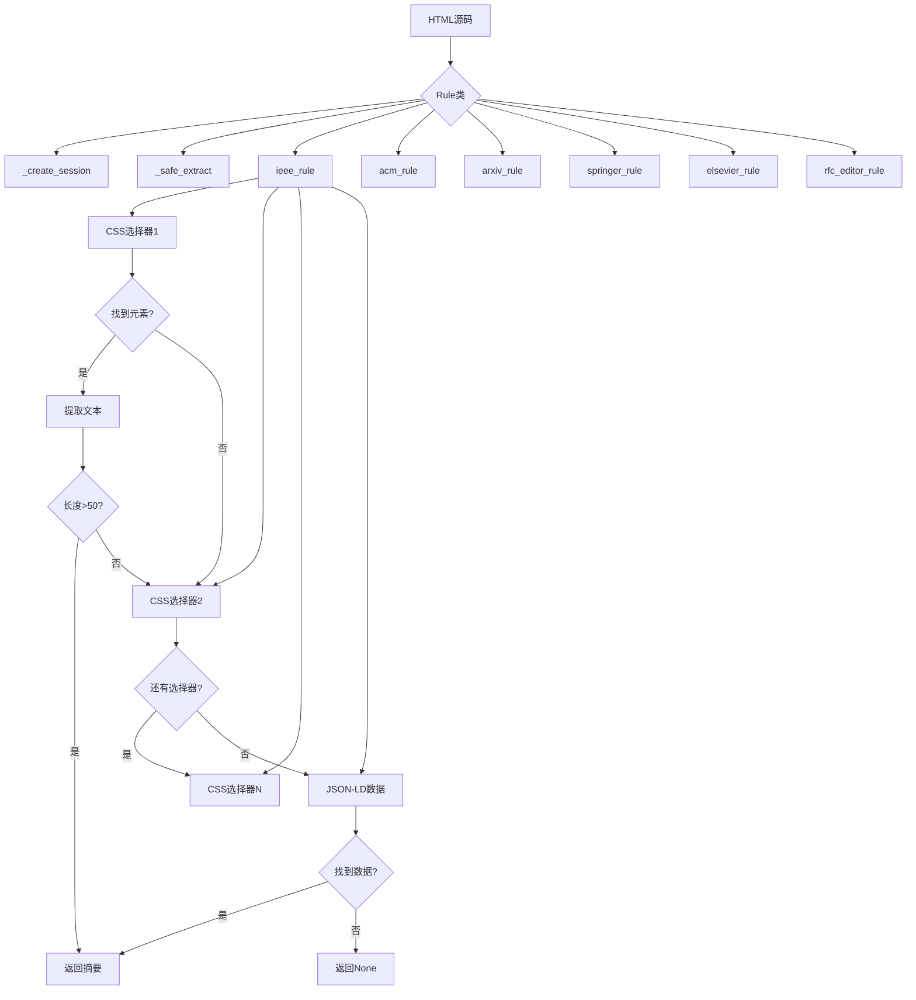

# Rule HTML解析规则详解

## 📋 目录

1. [项目概述](#项目概述)
2. [导入语句详解](#导入语句详解)
3. [全局常量定义](#全局常量定义)
4. [Rule类架构](#rule类架构)
5. [六大出版商解析规则](#六大出版商解析规则)
6. [技术总结](#技术总结)

---

## 📖 项目概述

`Rule.py` 是**学术论文摘要提取规则模块**，定义了针对不同学术出版商网站的HTML解析规则，用于从各种复杂的网页结构中提取论文摘要。

### 主要功能

- 🔍 **多出版商支持**: 支持6个主流学术出版商（IEEE、ACM、arXiv、Springer、Elsevier、RFC Editor）
- 🛡️ **容错机制**: 多层选择器尝试，提高解析成功率
- 🔄 **重试策略**: HTTP请求自动重试机制
- 🧹 **文本清理**: 自动清理无用元素和格式化文本
- 📊 **多种数据源**: 支持HTML元素、Meta标签、JSON-LD数据

### 核心设计思想

1. **优先级选择器**：按优先级尝试多个CSS选择器
2. **容错处理**：每个规则都有完整的异常处理
3. **文本清理**：自动移除无用元素和格式化
4. **数据来源多样**：HTML + Meta + JSON-LD
5. **质量验证**：长度检查确保提取内容有效

### 文件统计

- **总行数**: 404行
- **导入模块**: 10个
- **类数量**: 1个（Rule类）
- **方法数量**: 9个（2个工具方法 + 1个通用提取 + 6个出版商规则）
- **支持出版商**: 6个

### 系统架构图



---

## 📦 导入语句详解（第1-10行）

```python
from typing import Optional, Callable, Dict, List, Union  # 第1行
from dataclasses import dataclass                        # 第2行
from bs4 import BeautifulSoup                            # 第3行
import requests                                          # 第4行
from requests.adapters import HTTPAdapter                # 第5行
from urllib3.util.retry import Retry                     # 第6行
import random                                            # 第7行
import time                                              # 第8行
import json                                              # 第9行
import re                                                # 第10行
```

### 第1行：typing类型注解 ⭐⭐⭐⭐⭐

```python
from typing import Optional, Callable, Dict, List, Union

# typing模块详解
# 功能：提供类型提示（Type Hints）支持

# 为什么使用类型注解？
# 1. 代码可读性：一眼看出参数和返回值类型
# 2. IDE支持：自动补全和类型检查
# 3. 静态分析：mypy等工具可以检查类型错误
# 4. 文档作用：类型即文档

# Optional详解 ⭐⭐⭐⭐⭐
# 功能：表示值可以是指定类型或None

# 定义：
Optional[str]  # 等价于 Union[str, None]

# 使用示例：
def get_abstract(html: str) -> Optional[str]:
    if html:
        return "摘要内容"
    return None  # 可以返回None

# 不使用Optional（不推荐）：
def get_abstract(html: str) -> str:
    if html:
        return "摘要内容"
    return None  # 类型错误！str不能是None

# Callable详解 ⭐⭐⭐⭐
# 功能：表示可调用对象（函数）

# 语法：
Callable[[参数类型], 返回值类型]

# 示例：
def process(callback: Callable[[str], int]):
    result = callback("hello")
    return result

def my_callback(text: str) -> int:
    return len(text)

process(my_callback)  # 正确

# Dict详解 ⭐⭐⭐⭐⭐
# 功能：表示字典类型

# 语法：
Dict[键类型, 值类型]

# 示例：
headers: Dict[str, str] = {
    "Accept": "text/html",
    "User-Agent": "Mozilla/5.0"
}

# 复杂字典：
config: Dict[str, Union[str, int, List[str]]] = {
    "name": "test",
    "port": 8080,
    "hosts": ["host1", "host2"]
}

# List详解 ⭐⭐⭐⭐⭐
# 功能：表示列表类型

# 语法：
List[元素类型]

# 示例：
names: List[str] = ["Alice", "Bob", "Charlie"]
numbers: List[int] = [1, 2, 3, 4, 5]

# 嵌套列表：
matrix: List[List[int]] = [
    [1, 2, 3],
    [4, 5, 6]
]

# Union详解 ⭐⭐⭐⭐
# 功能：表示多种可能的类型之一

# 语法：
Union[类型1, 类型2, ...]

# 示例：
def process(value: Union[str, int]) -> str:
    if isinstance(value, str):
        return value.upper()
    else:
        return str(value)

process("hello")  # "HELLO"
process(123)      # "123"

# 本项目中的使用：
def ieee_rule(cls, html: str) -> Optional[str]:
    # 参数：html是字符串
    # 返回：字符串或None
    pass
```

### 第2行：dataclass装饰器 ⭐⭐⭐⭐⭐

```python
from dataclasses import dataclass

# dataclass详解
# 功能：自动生成类的特殊方法

# 不使用dataclass（传统方式）：
class Person:
    def __init__(self, name, age):
        self.name = name
        self.age = age
    
    def __repr__(self):
        return f"Person(name={self.name}, age={self.age})"
    
    def __eq__(self, other):
        return self.name == other.name and self.age == other.age

# 使用dataclass（推荐）：
from dataclasses import dataclass

@dataclass
class Person:
    name: str
    age: int

# 自动生成：
# - __init__方法
# - __repr__方法
# - __eq__方法
# - 等等

# 使用：
person = Person(name="Alice", age=30)
print(person)  # Person(name='Alice', age=30)

# dataclass参数：
@dataclass(
    frozen=True,    # 不可变（类似namedtuple）
    order=True      # 自动生成比较方法
)
class Point:
    x: int
    y: int

# frozen=True示例：
point = Point(1, 2)
# point.x = 3  # 错误！frozen对象不可修改

# order=True示例：
p1 = Point(1, 2)
p2 = Point(3, 4)
print(p1 < p2)  # True（自动比较）

# 本项目中的使用：
@dataclass
class Rule:
    # 使用dataclass定义Rule类
    # 虽然这里主要用于组织静态方法
    pass
```

### 第3行：BeautifulSoup HTML解析 ⭐⭐⭐⭐⭐

```python
from bs4 import BeautifulSoup

# BeautifulSoup详解
# 功能：HTML/XML解析库，最流行的网页解析工具

# 安装：
# pip install beautifulsoup4
# pip install lxml  # 推荐的解析器

# 基本使用：
from bs4 import BeautifulSoup

html = """
<html>
    <head><title>测试页面</title></head>
    <body>
        <div class="abstract">
            <p>这是摘要内容</p>
        </div>
    </body>
</html>
"""

soup = BeautifulSoup(html, 'lxml')

# 查找元素的方法：

# 1. find()：查找第一个匹配元素
element = soup.find('div', class_='abstract')
# <div class="abstract">...</div>

# 2. find_all()：查找所有匹配元素
paragraphs = soup.find_all('p')
# [<p>这是摘要内容</p>]

# 3. select_one()：CSS选择器（单个）⭐推荐
element = soup.select_one('div.abstract')
# <div class="abstract">...</div>

# 4. select()：CSS选择器（多个）⭐推荐
elements = soup.select('div.abstract p')
# [<p>这是摘要内容</p>]

# CSS选择器语法：

# 类选择器：
soup.select_one('.abstract')        # class="abstract"
soup.select_one('div.abstract')     # <div class="abstract">

# ID选择器：
soup.select_one('#main')            # id="main"
soup.select_one('div#main')         # <div id="main">

# 属性选择器：
soup.select_one('[name="description"]')           # name属性
soup.select_one('meta[name="description"]')       # meta标签的name属性
soup.select_one('div[class*="abstract"]')         # class包含"abstract"
soup.select_one('meta[property="og:description"]') # property属性

# 层级选择器：
soup.select_one('div > p')          # 直接子元素
soup.select_one('div p')            # 所有后代元素
soup.select_one('div.abstract p')   # 嵌套选择

# 提取数据：

# 1. 获取文本
element = soup.select_one('div.abstract')
text = element.text          # 所有文本（包括子元素）
text = element.get_text()    # 同上，可以指定分隔符

# 2. 获取属性
meta = soup.select_one('meta[name="description"]')
content = meta.get('content')        # 获取content属性
content = meta['content']            # 同上（字典方式）

# 3. 检查属性存在
if meta.has_attr('content'):
    content = meta['content']

# 修改和删除：

# 1. 删除元素
for script in soup.find_all('script'):
    script.decompose()  # 从树中删除

# 2. 提取元素（删除并返回）
element = soup.find('div').extract()

# 本项目中的典型使用：
soup = BeautifulSoup(html, 'lxml')

# 尝试多个选择器
selectors = [
    'meta[name="description"]',
    'div.abstract',
    '#abstract'
]

for selector in selectors:
    element = soup.select_one(selector)
    if element:
        if element.name == 'meta':
            abstract = element.get('content', '').strip()
        else:
            # 移除不需要的元素
            for unwanted in element.find_all(['script', 'style']):
                unwanted.decompose()
            abstract = element.get_text().strip()
        
        if abstract and len(abstract) > 50:
            return abstract
```

### 第4-6行：HTTP请求库 ⭐⭐⭐⭐⭐

```python
import requests                                    # 第4行
from requests.adapters import HTTPAdapter          # 第5行
from urllib3.util.retry import Retry               # 第6行

# requests库详解
# 功能：Python最流行的HTTP客户端库

# 基本使用：
import requests

# GET请求
response = requests.get('https://www.example.com')
html = response.text
status_code = response.status_code

# POST请求
response = requests.post('https://api.example.com', 
    json={'key': 'value'},
    headers={'Content-Type': 'application/json'}
)

# 请求头
headers = {
    'User-Agent': 'Mozilla/5.0',
    'Accept': 'text/html'
}
response = requests.get(url, headers=headers)

# Session使用（保持连接）
session = requests.Session()
session.headers.update({'User-Agent': 'MyBot'})
response = session.get(url1)
response = session.get(url2)  # 复用连接

# HTTPAdapter详解 ⭐⭐⭐⭐
# 功能：自定义传输适配器

# 作用：
# 1. 设置连接池大小
# 2. 配置重试策略
# 3. 设置超时

# Retry详解 ⭐⭐⭐⭐⭐
# 功能：自动重试失败的请求

# 完整示例：
from requests.adapters import HTTPAdapter
from urllib3.util.retry import Retry
import requests

# 创建重试策略
retry_strategy = Retry(
    total=3,                    # 总共重试3次
    backoff_factor=0.5,         # 重试间隔：0.5s, 1s, 2s
    status_forcelist=[429, 500, 502, 503, 504],  # 这些状态码才重试
    allowed_methods=["GET"]     # 只对GET请求重试
)

# 创建适配器
adapter = HTTPAdapter(max_retries=retry_strategy)

# 创建会话并挂载适配器
session = requests.Session()
session.mount("https://", adapter)  # 对https请求使用此适配器
session.mount("http://", adapter)   # 对http请求使用此适配器

# 使用会话发送请求
response = session.get('https://example.com')

# 重试参数详解：

# total：最大重试次数
# 示例：total=3，失败后最多再尝试3次

# backoff_factor：重试延迟因子
# 计算公式：{backoff_factor} * (2 ** (重试次数 - 1))
# backoff_factor=0.5：
# - 第1次重试：0.5 * 2^0 = 0.5秒
# - 第2次重试：0.5 * 2^1 = 1秒
# - 第3次重试：0.5 * 2^2 = 2秒

# status_forcelist：需要重试的HTTP状态码
# 429：Too Many Requests（请求过多）
# 500：Internal Server Error（服务器内部错误）
# 502：Bad Gateway（网关错误）
# 503：Service Unavailable（服务不可用）
# 504：Gateway Timeout（网关超时）

# allowed_methods：允许重试的HTTP方法
# ["GET"]：只重试GET请求
# ["GET", "POST"]：GET和POST都重试

# 本项目中的使用：
RETRY_STRATEGY = Retry(
    total=3,
    backoff_factor=0.5,
    status_forcelist=[429, 500, 502, 503, 504],
    allowed_methods=["GET"]
)

@staticmethod
def _create_session() -> requests.Session:
    session = requests.Session()
    session.mount("https://", HTTPAdapter(max_retries=Rule.RETRY_STRATEGY))
    return session

# 使用：
session = Rule._create_session()
response = session.get(url)
# 如果失败，自动重试最多3次
```

### 第7-10行：其他工具库

```python
import random     # 第7行
import time       # 第8行
import json       # 第9行
import re         # 第10行

# random模块
# 用途：随机数生成
# 本项目中可能用于：
# - 随机延迟
# - 随机选择User-Agent

import random
random.randint(1, 5)      # 1到5的随机整数
random.choice(['a', 'b']) # 随机选择

# time模块
# 用途：时间处理
# 本项目中可能用于：
# - 请求延迟
time.sleep(1)  # 暂停1秒

# json模块
# 用途：JSON数据处理
# 本项目中用于：
# - 解析JSON-LD数据
data = json.loads(script.string)

# re模块（正则表达式）⭐⭐⭐⭐⭐
# 用途：文本模式匹配

# 基本使用：
import re

# 1. re.sub()：替换
text = "Abstract: This is the abstract."
text = re.sub(r'^abstract\s*:?\s*', '', text, flags=re.IGNORECASE)
# "This is the abstract."

# 参数详解：
# r'^abstract\s*:?\s*'：正则表达式模式
# ''：替换为空字符串
# text：要处理的文本
# flags=re.IGNORECASE：忽略大小写

# 正则表达式语法：
# ^：字符串开头
# abstract：匹配"abstract"
# \s*：0个或多个空白字符
# :?：0个或1个冒号
# \s*：0个或多个空白字符

# 示例：
text1 = "Abstract: content"
text2 = "abstract content"
text3 = "ABSTRACT:content"
# 都会被替换为："content"

# re.IGNORECASE标志：
# 忽略大小写匹配
re.sub('abstract', '', 'Abstract')  # 'Abstract'（不匹配）
re.sub('abstract', '', 'Abstract', flags=re.IGNORECASE)  # ''（匹配）

# 其他常用re方法：
re.match(r'pattern', text)   # 从开头匹配
re.search(r'pattern', text)  # 搜索匹配
re.findall(r'pattern', text) # 找到所有匹配
```

---

## 🌐 全局常量定义（第12-19行）

```python
# 公共请求头模板                              # 第12行（注释）
HEADER_TEMPLATE: Dict[str, str] = {         # 第13行
    "Accept": "text/html,application/xhtml+xml,application/xml;q=0.9,*/*;q=0.8",  # 第14行
    "Accept-Language": "en-US,en;q=0.9",    # 第15行
    "Accept-Encoding": "gzip, deflate, br"  # 第16行
}

CCF_RANKS = {"A", "B", "C", "E", "P"}       # 第19行
```

**全局常量详解**：

```python
# HEADER_TEMPLATE详解 ⭐⭐⭐⭐⭐
# 类型：Dict[str, str]
# 作用：HTTP请求头模板

HEADER_TEMPLATE: Dict[str, str] = {
    "Accept": "text/html,application/xhtml+xml,application/xml;q=0.9,*/*;q=0.8",
    "Accept-Language": "en-US,en;q=0.9",
    "Accept-Encoding": "gzip, deflate, br"
}

# HTTP请求头详解：

# 1. Accept头
# 作用：告诉服务器客户端能接受的内容类型
"Accept": "text/html,application/xhtml+xml,application/xml;q=0.9,*/*;q=0.8"

# 分解：
# - text/html：HTML文档
# - application/xhtml+xml：XHTML文档
# - application/xml;q=0.9：XML文档（质量因子0.9）
# - */*;q=0.8：任何类型（质量因子0.8）

# q值（质量因子）：
# 范围：0.0 - 1.0
# 表示优先级
# q=1.0（默认）：最高优先级
# q=0.9：次优先级
# q=0.8：更低优先级

# 服务器会选择最匹配且质量因子最高的格式返回

# 2. Accept-Language头
# 作用：告诉服务器客户端的语言偏好
"Accept-Language": "en-US,en;q=0.9"

# 分解：
# - en-US：美式英语（优先）
# - en;q=0.9：英语（次优先）

# 3. Accept-Encoding头
# 作用：告诉服务器支持的压缩算法
"Accept-Encoding": "gzip, deflate, br"

# 压缩算法：
# - gzip：最常用的压缩
# - deflate：另一种压缩
# - br：Brotli压缩（更高效）

# 为什么需要请求头？
# 1. 模拟浏览器行为
# 2. 避免被服务器拒绝
# 3. 获得正确格式的响应
# 4. 提高请求成功率

# 使用示例：
headers = HEADER_TEMPLATE.copy()
headers['User-Agent'] = 'Mozilla/5.0...'
response = requests.get(url, headers=headers)

# CCF_RANKS详解
# 类型：集合（set）
# 作用：CCF会议/期刊等级

CCF_RANKS = {"A", "B", "C", "E", "P"}

# CCF分级：
# A：顶级会议/期刊
# B：优秀会议/期刊
# C：普通会议/期刊
# E：其他
# P：（可能表示Pending或其他）

# set vs list：
# set：
# - 无序
# - 不允许重复
# - 成员检查快速（O(1)）

# list：
# - 有序
# - 允许重复
# - 成员检查慢（O(n)）

# 检查成员：
if "A" in CCF_RANKS:  # 非常快
    print("是CCF-A级")

# 为什么用set？
# 快速检查某个等级是否有效
```

---

继续创建Rule类的详细讲解部分...

