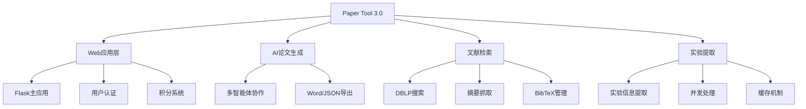
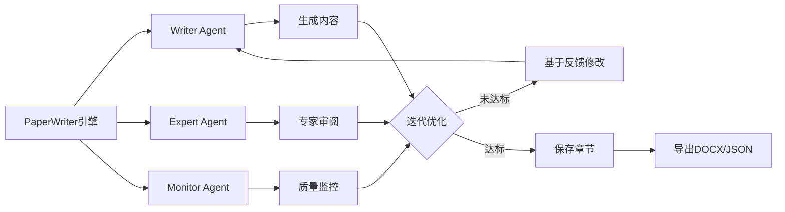
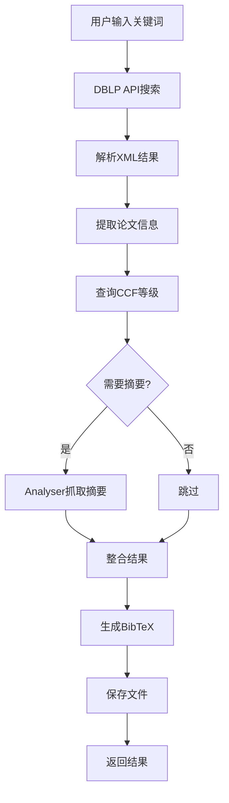
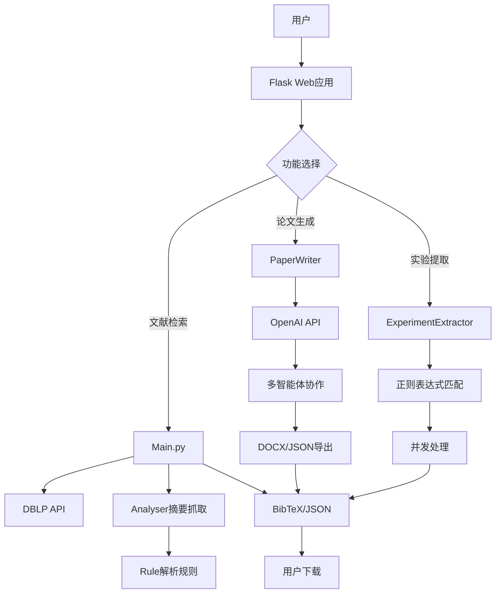

# Paper Tool 3.0 项目完整分析报告

## 📋 目录

1. [项目概述](#项目概述)
2. [核心应用文件](#核心应用文件)
3. [AI论文生成模块](#ai论文生成模块)
4. [文献检索模块](#文献检索模块)
5. [实验提取模块](#实验提取模块)
6. [工具模块](#工具模块)
7. [数据库模块](#数据库模块)
8. [配置和数据文件](#配置和数据文件)
9. [前端资源](#前端资源)
10. [文档文件](#文档文件)
11. [技术架构总结](#技术架构总结)

---

## 📖 项目概述

**Paper Tool 3.0** 是一个**集成化的学术研究辅助平台**，提供文献检索、论文生成、实验信息提取等功能。

### 核心功能模块



### 项目统计

| 指标 | 数量 |
|------|------|
| **Python文件** | 13个 |
| **总代码行数** | ~8,000行 |
| **支持出版商** | 6个（IEEE、ACM、arXiv、Springer、Elsevier、RFC） |
| **AI模型支持** | 2个（GPT-4、DeepSeek） |
| **数据库表** | 3个（User、UserActivity、CreditPackage） |
| **JSON配置文件** | 7个 |

---

## 🌐 核心应用文件

### 1. app.py（主应用）⭐⭐⭐⭐⭐

**文件大小**: 80KB（2366行）  
**作用**: Flask主应用，整个系统的核心枢纽

#### 主要功能

1. **应用初始化**
   - Flask应用创建和配置
   - 数据库初始化（SQLAlchemy）
   - 用户认证系统（Flask-Login）
   - 会话管理

2. **用户管理**
   - 用户注册、登录、登出
   - 密码修改
   - 管理员权限控制

3. **积分系统**
   - 积分充值
   - 积分消费记录
   - 套餐购买

4. **文献检索功能**
   - DBLP搜索接口
   - 摘要抓取
   - BibTeX导出
   - JSON结果管理

5. **实验信息提取**
   - 上传JSON文件
   - 提取实验信息
   - 结果下载

6. **文件管理**
   - 文件上传/下载
   - 历史记录查看
   - 文件清理

#### 核心方法

```python
# 应用配置
app = Flask(__name__)
app.config['SECRET_KEY'] = '...'
app.config['SQLALCHEMY_DATABASE_URI'] = 'sqlite:///users.db'

# 主要路由
@app.route('/')                          # 首页
@app.route('/login', methods=['GET', 'POST'])  # 登录
@app.route('/register', methods=['GET', 'POST'])  # 注册
@app.route('/search', methods=['POST'])  # 文献搜索
@app.route('/extract_experiments', methods=['POST'])  # 实验提取
@app.route('/download/<filename>')       # 文件下载

# 关键技术
- Flask-Login: 用户会话管理
- SQLAlchemy: ORM数据库操作
- Werkzeug: 安全文件处理
- JSON: 数据交换
```

#### 设计模式

- **MVC模式**: 路由（Controller）+ 模板（View）+ 模型（Model）
- **装饰器模式**: @login_required保护路由
- **工厂模式**: Blueprint注册

---

### 2. models.py（数据库模型）⭐⭐⭐⭐⭐

**文件大小**: 2.8KB（68行）  
**作用**: 定义数据库模型和积分系统

#### 数据库表结构

**User表**（用户）
```python
class User(UserMixin, db.Model):
    id              # 主键
    username        # 用户名（唯一）
    email           # 邮箱（唯一）
    password_hash   # 密码哈希
    credits         # 积分余额
    is_admin        # 管理员标志
    created_at      # 创建时间
```

**UserActivity表**（用户活动）
```python
class UserActivity(db.Model):
    id              # 主键
    user_id         # 用户ID（外键）
    activity_type   # 活动类型
    description     # 描述
    credits_used    # 消费积分
    created_at      # 创建时间
```

**CreditPackage表**（积分套餐）
```python
class CreditPackage(db.Model):
    id          # 主键
    name        # 套餐名称
    credits     # 积分数量
    price       # 价格
    description # 描述
```

#### 核心方法

```python
# User类方法
def set_password(password)           # 设置密码（哈希）
def check_password(password)         # 验证密码
def has_credits(amount)              # 检查积分
def deduct_credits(amount, activity) # 扣除积分
def add_credits(amount, description) # 增加积分

# 积分消费配置
CREDIT_COSTS = {
    'search': 1,              # 搜索消费1积分
    'extract_abstract': 2,    # 提取摘要2积分
    'extract_experiment': 3,  # 提取实验3积分
    'paper_generation': 10    # 生成论文10积分
}
```

#### 关键技术

- **SQLAlchemy ORM**: 对象关系映射
- **werkzeug.security**: 密码哈希（pbkdf2:sha256）
- **Flask-Login**: UserMixin混入
- **关系映射**: User ↔ UserActivity（一对多）

---

### 3. init_db.py（数据库初始化）⭐⭐⭐

**文件大小**: 1.8KB（53行）  
**作用**: 初始化数据库，创建表和默认数据

#### 主要功能

```python
def init_database():
    # 1. 创建所有表
    db.create_all()
    
    # 2. 创建管理员账户
    admin = User(username='admin', email='admin@example.com')
    admin.set_password('admin123')
    admin.is_admin = True
    admin.credits = 1000
    
    # 3. 创建积分套餐
    packages = [
        CreditPackage(name='基础套餐', credits=100, price=10.0),
        CreditPackage(name='标准套餐', credits=500, price=40.0),
        CreditPackage(name='高级套餐', credits=1000, price=70.0)
    ]
    
    # 4. 提交到数据库
    db.session.add(admin)
    db.session.add_all(packages)
    db.session.commit()

if __name__ == '__main__':
    init_database()
```

#### 使用方法

```bash
# 初始化数据库
python init_db.py
```

---

## 🤖 AI论文生成模块

### 4. paper_writer.py（论文生成引擎）⭐⭐⭐⭐⭐

**文件大小**: 17KB（410行）  
**作用**: 基于多智能体协作的AI论文自动生成系统

#### 核心架构



#### 主要类和方法

**PaperWritingAgent类**（智能体）
```python
class PaperWritingAgent:
    def __init__(role, instructions, api_key, model, base_url, model_provider)
    def __call__(prompt, system_message=None)  # 执行对话
    def reset_history()                        # 重置历史
```

**PaperWriter类**（论文引擎）
```python
class PaperWriter:
    def __init__(instructions_file, api_key, model, base_url, model_provider)
    def set_parameters(field, theme, scenario, problem, goal, ...)  # 设置参数
    def set_language(language)                 # 设置语言（zh/en）
    def generate_section(section_name)         # 生成单个章节
    def generate_full_paper()                  # 生成完整论文
    def save_to_docx(output_file)              # 导出Word
    def export_to_json(output_file)            # 导出JSON
```

#### 工作流程

1. **参数设置**: 设置研究领域、主题、场景、问题、目标
2. **智能体初始化**: Writer、Expert、Monitor三个角色
3. **章节生成**: 按顺序生成8个标准章节
   - 研究背景
   - 需求场景
   - 研究问题
   - 研究目标
   - 解决方案
   - 创新点
   - 技术路线
   - 实验设计
4. **迭代优化**: 每个章节最多3次迭代
5. **质量控制**: 专家审阅 + 监控检查
6. **文件导出**: DOCX + JSON格式

#### 关键技术

- **OpenAI API**: GPT-4、DeepSeek等大语言模型
- **python-docx**: Word文档生成
- **JSON配置**: 外部化提示词模板
- **多智能体**: 协作生成和优化
- **迭代机制**: 基于反馈改进

---

### 5. paper_writer_routes.py（论文生成路由）⭐⭐⭐⭐

**文件大小**: 9.6KB（271行）  
**作用**: Flask Blueprint，处理论文生成相关的HTTP请求

#### 主要路由

```python
@paper_writer_bp.route('/')                        # 首页
@paper_writer_bp.route('/template')                # 模板页
@paper_writer_bp.route('/generate', methods=['GET', 'POST'])  # 生成论文
@paper_writer_bp.route('/status')                  # 查询状态
@paper_writer_bp.route('/download/<filename>')     # 下载文件
@paper_writer_bp.route('/history')                 # 历史记录
```

#### 核心功能

**1. 实例池管理**
```python
writer_instances = {}  # 全局字典，存储用户的PaperWriter实例

def get_writer_instance(user_id, model_provider="gpt"):
    instance_key = f"{user_id}_{model_provider}"
    if instance_key not in writer_instances:
        # 创建新实例
        writer_instances[instance_key] = PaperWriter(...)
    return writer_instances[instance_key]
```

**2. 论文生成处理**
```python
@paper_writer_bp.route('/generate', methods=['POST'])
def generate():
    # 1. 获取参数
    data = request.json
    field = data.get('field')
    theme = data.get('theme')
    # ...
    
    # 2. 获取或创建Writer实例
    writer = get_writer_instance(user_id, model_provider)
    
    # 3. 设置参数
    writer.set_parameters(field, theme, scenario, problem, goal)
    
    # 4. 生成论文
    success = writer.generate_full_paper()
    
    # 5. 保存文件
    docx_path = writer.save_to_docx(output_file)
    json_path = writer.export_to_json(output_file)
    
    # 6. 返回结果
    return jsonify({'success': True, 'output_docx': docx_path})
```

#### 关键技术

- **Flask Blueprint**: 模块化路由
- **实例池模式**: 复用PaperWriter实例
- **Session状态**: 追踪生成进度
- **文件下载**: send_from_directory安全下载

---

### 6. paper_writing_instructions.json（配置文件）⭐⭐⭐⭐

**文件大小**: 6.0KB（82行）  
**作用**: AI论文生成的提示词模板配置

#### 配置结构

```json
{
  "system_instructions": {
    "writer_agent": "你是论文撰写专家...",
    "expert_agent": "你是学术审阅专家...",
    "monitor_agent": "你是质量监控专家..."
  },
  "prompts": {
    "section_prompts": {
      "background": {
        "zh": "请生成{field}领域关于{theme}的研究背景...",
        "en": "Please generate background on {theme} in {field}..."
      },
      "research_problem": {...},
      ...
    },
    "review_prompts": {
      "expert_review": {...},
      "monitor_check": {...}
    },
    "feedback_integration": {...}
  },
  "workflow": {
    "section_order": ["background", "requirement_scene", ...],
    "max_iterations_per_section": 3,
    "min_feedback_length": 50
  }
}
```

---

## 📚 文献检索模块

### 7. Main.py（文献搜索核心）⭐⭐⭐⭐⭐

**文件大小**: 48KB（1475行）  
**作用**: 学术文献搜索和BibTeX管理的核心引擎

#### 主要类和功能

**BibManager类**（BibTeX管理器）
```python
class BibManager:
    def __init__()
    def load_ccf_data()           # 加载CCF分级数据
    def search_dblp(query, max_results)  # DBLP搜索
    def parse_dblp_xml(xml_data)  # 解析DBLP XML
    def get_ccf_rank(venue_name)  # 获取CCF等级
    def fetch_abstract(url)       # 抓取摘要
    def generate_bibtex(entry)    # 生成BibTeX
    def save_results(entries, output_bib, output_json)  # 保存结果
```

#### 工作流程



#### 核心方法

**1. DBLP搜索**
```python
def search_dblp(query, max_results=50):
    # 1. 构建DBLP API URL
    url = f"https://dblp.org/search/publ/api?q={query}&h={max_results}&format=xml"
    
    # 2. 发送请求
    response = requests.get(url)
    
    # 3. 解析XML
    entries = parse_dblp_xml(response.text)
    
    # 4. 获取CCF等级
    for entry in entries:
        entry['ccf_rank'] = get_ccf_rank(entry['venue'])
    
    return entries
```

**2. CCF等级查询**
```python
def get_ccf_rank(venue_name):
    # 1. 标准化会议/期刊名称
    normalized = venue_name.lower().strip()
    
    # 2. 在CCF数据中查找
    for ccf_venue in ccf_data:
        if normalized in ccf_venue['aliases']:
            return ccf_venue['rank']  # A, B, C
    
    return None  # 未收录
```

**3. BibTeX生成**
```python
def generate_bibtex(entry):
    bibtex = f"@{entry['type']}{{{entry['key']},\n"
    bibtex += f"  author = {{{entry['authors']}}},\n"
    bibtex += f"  title = {{{entry['title']}}},\n"
    bibtex += f"  year = {{{entry['year']}}},\n"
    # ...
    bibtex += "}\n"
    return bibtex
```

#### 关键技术

- **DBLP API**: RESTful接口查询
- **XML解析**: ElementTree解析XML
- **CCF数据**: JSON格式存储和查询
- **BibTeX格式**: 标准学术引用格式
- **Analyser集成**: 摘要抓取

---

### 8. Analyser.py（摘要抓取器）⭐⭐⭐⭐⭐

**文件大小**: 37KB（944行）  
**作用**: 从各大学术出版商网站抓取论文摘要

#### 核心架构

```python
class Analyser:
    def __init__()
    def set_proxies(proxies)              # 设置代理
    def fetch_abstract(url, ccf_rank)     # 抓取摘要（主方法）
    def _determine_source(url)            # 判断来源
    def _get_html_with_retry(url, max_retries)  # 带重试的HTML获取
    def _apply_parsing_rule(html, source) # 应用解析规则
```

#### 支持的出版商

| 出版商 | 域名 | 解析规则 |
|--------|------|---------|
| **IEEE** | ieeexplore.ieee.org | Rule.ieee_rule |
| **ACM** | dl.acm.org | Rule.acm_rule |
| **arXiv** | arxiv.org | Rule.arxiv_rule |
| **Springer** | link.springer.com | Rule.springer_rule |
| **Elsevier** | sciencedirect.com | Rule.elsevier_rule |
| **RFC Editor** | rfc-editor.org | Rule.rfc_editor_rule |

#### 工作流程

```python
def fetch_abstract(url, ccf_rank=None):
    # 1. 判断来源
    source = _determine_source(url)
    if not source:
        return None
    
    # 2. 获取HTML
    html = _get_html_with_retry(url, max_retries=3)
    if not html:
        return None
    
    # 3. 应用解析规则
    abstract = _apply_parsing_rule(html, source)
    
    # 4. 验证结果
    if abstract and len(abstract) > 50:
        return abstract
    
    return None
```

#### 关键技术

- **代理池**: 轮换代理避免封禁
- **重试机制**: 自动重试失败请求
- **User-Agent轮换**: 模拟不同浏览器
- **BeautifulSoup**: HTML解析
- **Rule模块**: 6个出版商的解析规则

---

### 9. Rule.py（HTML解析规则）⭐⭐⭐⭐⭐

**文件大小**: 17KB（404行）  
**作用**: 定义各出版商网站的HTML解析规则

#### 核心方法

```python
class Rule:
    @staticmethod
    def _create_session()  # 创建带重试的会话
    
    @staticmethod
    def _safe_extract(soup, selector, attr)  # 安全提取元素
    
    @classmethod
    def ieee_rule(html)      # IEEE解析规则
    
    @classmethod
    def acm_rule(html)       # ACM解析规则
    
    @classmethod
    def arxiv_rule(html)     # arXiv解析规则
    
    @classmethod
    def springer_rule(html)  # Springer解析规则
    
    @classmethod
    def elsevier_rule(html)  # Elsevier解析规则
    
    @classmethod
    def rfc_editor_rule(html)  # RFC Editor解析规则
```

#### 解析策略

**优先级选择器模式**
```python
def ieee_rule(html):
    selectors = [
        'meta[property="twitter:description"]',  # 优先级1
        'meta[name="description"]',              # 优先级2
        'div.abstract-text',                     # 优先级3
        # ... 更多选择器
    ]
    
    for selector in selectors:
        abstract = try_extract(selector)
        if abstract and len(abstract) > 50:
            return abstract  # 找到即返回
    
    return None
```

#### 关键技术

- **CSS选择器**: 精确定位HTML元素
- **BeautifulSoup**: HTML解析
- **正则表达式**: 文本清理
- **JSON-LD**: 结构化数据提取
- **异常处理**: 容错机制

---

## 🔬 实验提取模块

### 10. experiment_extractor.py（实验信息提取器）⭐⭐⭐⭐⭐

**文件大小**: 50KB（1266行）  
**作用**: 从论文JSON数据中提取实验信息（数据集、指标、结果等）

#### 主要类和方法

**ExperimentExtractor类**
```python
class ExperimentExtractor:
    def __init__()
    def extract_from_json(json_file)       # 从JSON提取
    def extract_from_abstract(abstract)    # 从摘要提取
    def _extract_datasets(text)            # 提取数据集
    def _extract_metrics(text)             # 提取评价指标
    def _extract_results(text)             # 提取实验结果
    def _extract_methods(text)             # 提取方法
    def save_results(results, output_file) # 保存结果
```

#### 提取内容

| 类型 | 示例 | 正则表达式 |
|------|------|-----------|
| **数据集** | ImageNet, CIFAR-10 | `r'\b[A-Z][A-Za-z0-9-]+(?:-\d+)?\b'` |
| **指标** | Accuracy, F1-score | `r'\b(?:accuracy|precision|recall|f1)\b'` |
| **数值结果** | 95.3%, 0.89 | `r'\d+\.?\d*%?'` |
| **方法** | CNN, Transformer | `r'\b[A-Z]{2,}\b'` |

#### 工作流程

```python
def extract_from_json(json_file):
    # 1. 读取JSON文件
    with open(json_file) as f:
        data = json.load(f)
    
    # 2. 遍历每篇论文
    results = []
    for paper in data:
        abstract = paper.get('abstract', '')
        
        # 3. 提取各类信息
        info = {
            'title': paper['title'],
            'datasets': _extract_datasets(abstract),
            'metrics': _extract_metrics(abstract),
            'results': _extract_results(abstract),
            'methods': _extract_methods(abstract)
        }
        results.append(info)
    
    # 4. 保存结果
    save_results(results, 'experiment_results.json')
    return results
```

#### 关键技术

- **正则表达式**: 模式匹配提取
- **并发处理**: ThreadPoolExecutor加速
- **缓存机制**: pickle缓存避免重复计算
- **统计分析**: 数据集和方法统计

---

### 11. extract_experiments.py（命令行工具）⭐⭐⭐

**文件大小**: 1.6KB（52行）  
**作用**: 实验信息提取的命令行接口

#### 使用方法

```bash
# 基本用法
python extract_experiments.py input.json

# 指定输出文件
python extract_experiments.py input.json -o output.json

# 批量处理
python extract_experiments.py *.json
```

#### 核心代码

```python
def main():
    parser = argparse.ArgumentParser(description='提取实验信息')
    parser.add_argument('input', help='输入JSON文件')
    parser.add_argument('-o', '--output', help='输出文件')
    args = parser.parse_args()
    
    # 创建提取器
    extractor = ExperimentExtractor()
    
    # 执行提取
    results = extractor.extract_from_json(args.input)
    
    # 保存结果
    output = args.output or 'experiment_results.json'
    extractor.save_results(results, output)
    
    print(f"提取完成，结果保存到：{output}")

if __name__ == '__main__':
    main()
```

---

## 🔧 工具模块

### 12. generate.py（文档生成器）⭐⭐⭐⭐

**文件大小**: 17KB（499行）  
**作用**: 基于OpenAI API生成学术文档（如Related Work部分）

#### 主要功能

```python
def generate_related_work(json_file, output_format='docx'):
    # 1. 读取论文数据
    with open(json_file) as f:
        papers = json.load(f)
    
    # 2. 构建提示词
    prompt = build_prompt(papers)
    
    # 3. 调用OpenAI API
    response = openai.ChatCompletion.create(
        model="gpt-4",
        messages=[
            {"role": "system", "content": "你是学术写作专家"},
            {"role": "user", "content": prompt}
        ]
    )
    
    # 4. 提取生成内容
    content = response.choices[0].message.content
    
    # 5. 保存为指定格式
    if output_format == 'docx':
        save_to_docx(content, 'related_work.docx')
    elif output_format == 'latex':
        save_to_latex(content, 'related_work.tex')
    
    return content
```

#### 支持格式

- **DOCX**: Word文档（python-docx）
- **LaTeX**: LaTeX源码
- **BibTeX**: 参考文献

#### 关键技术

- **OpenAI API**: GPT-4生成内容
- **python-docx**: Word文档生成
- **LaTeX**: 学术论文格式
- **BibTeX**: 引用管理

---

### 13. merger.py（结果合并器）⭐⭐⭐⭐

**文件大小**: 7.7KB（184行）  
**作用**: 合并多个JSON和BibTeX文件，去重

#### 主要类和方法

**ResultMerger类**
```python
class ResultMerger:
    def __init__()
    def merge_json_files(json_files, output_file)  # 合并JSON
    def merge_bib_files(bib_files, output_file)    # 合并BibTeX
    def deduplicate_entries(entries)               # 去重
    def save_merged_results(entries, output_json, output_bib)  # 保存
```

#### 去重逻辑

```python
def deduplicate_entries(entries):
    seen = set()
    unique_entries = []
    
    for entry in entries:
        # 使用标题+年份作为唯一标识
        key = (entry['title'].lower(), entry['year'])
        
        if key not in seen:
            seen.add(key)
            unique_entries.append(entry)
    
    return unique_entries
```

#### 使用场景

- 合并多次搜索结果
- 去除重复论文
- 整理文献库

---

## 🗄️ 数据库模块

已在前面的 models.py 和 init_db.py 中详细介绍。

---

## 📁 配置和数据文件

### JSON配置文件

| 文件名 | 大小 | 作用 |
|--------|------|------|
| **期刊会议.json** | 198KB | CCF分级完整数据 |
| **journal.json** | 96KB | 期刊列表 |
| **conference.json** | 20KB | 会议列表 |
| **ccf_rank_url.json** | 17KB | CCF等级和URL映射 |
| **paper_writing_instructions.json** | 6.0KB | AI论文生成配置 |
| **process_history.json** | 2B | 处理历史记录 |

### 数据库文件

| 文件名 | 大小 | 作用 |
|--------|------|------|
| **users.db** | 24KB | SQLite用户数据库 |

### 引用文件

| 文件名 | 大小 | 作用 |
|--------|------|------|
| **references.bib** | 37KB | BibTeX参考文献 |
| **references.json** | 86KB | JSON格式参考文献 |

---

## 🎨 前端资源

### 目录结构

```
templates/          # Jinja2模板
├── base.html      # 基础模板
├── index.html     # 首页
├── login.html     # 登录页
├── search.html    # 搜索页
└── paper_writer/  # 论文生成模块模板
    ├── index.html
    ├── generate.html
    └── history.html

static/            # 静态资源
├── css/          # 样式表
├── js/           # JavaScript
└── images/       # 图片
```

### 前端技术

- **Bootstrap**: UI框架
- **jQuery**: JavaScript库
- **AJAX**: 异步请求
- **Chart.js**: 图表展示（可能）

---

## 📖 文档文件

| 文件名 | 大小 | 作用 |
|--------|------|------|
| **README.md** | 5.7KB | 项目说明 |
| **PAPER_WRITER_README.md** | 6.1KB | 论文生成模块说明 |
| **deploy_guide.md** | 9.1KB | 部署指南 |
| **requirements.txt** | 497B | Python依赖 |
| **Paper_Tool_3.0_Flask应用详解.md** | 71KB | Flask应用详解 |

---

## 🏗️ 技术架构总结

### 技术栈

#### 后端框架

| 技术 | 版本 | 用途 |
|------|------|------|
| **Flask** | 2.x | Web框架 |
| **Flask-Login** | - | 用户认证 |
| **Flask-SQLAlchemy** | - | ORM |
| **SQLite** | 3.x | 数据库 |

#### AI和NLP

| 技术 | 用途 |
|------|------|
| **OpenAI API** | GPT-4论文生成 |
| **DeepSeek API** | 备选AI模型 |

#### 网络爬虫

| 技术 | 用途 |
|------|------|
| **requests** | HTTP请求 |
| **BeautifulSoup4** | HTML解析 |
| **lxml** | XML/HTML解析器 |
| **urllib3** | HTTP客户端 |

#### 文档处理

| 技术 | 用途 |
|------|------|
| **python-docx** | Word文档生成 |
| **LaTeX** | 学术论文格式 |
| **BibTeX** | 引用管理 |

#### 数据处理

| 技术 | 用途 |
|------|------|
| **json** | JSON处理 |
| **re** | 正则表达式 |
| **pickle** | 对象序列化 |
| **pandas** | 数据分析（可能） |

### 设计模式

1. **MVC模式**: 分离关注点
2. **Blueprint模式**: 模块化路由
3. **ORM模式**: 对象关系映射
4. **单例模式**: Writer实例池
5. **工厂模式**: 规则选择
6. **策略模式**: 多种解析策略
7. **装饰器模式**: 权限控制

### 系统流程



---

## 🎓 项目特点总结

### 优势

1. ✅ **功能完整**: 文献检索、论文生成、实验提取一体化
2. ✅ **AI赋能**: 集成GPT-4等先进AI模型
3. ✅ **多源支持**: 支持6大学术出版商
4. ✅ **容错设计**: 重试机制、异常处理完善
5. ✅ **用户系统**: 完整的认证和积分管理
6. ✅ **模块化**: Blueprint和类设计良好
7. ✅ **可扩展**: 易于添加新功能和规则

### 技术亮点

1. 🌟 **多智能体协作**: Writer + Expert + Monitor
2. 🌟 **实例池模式**: 优化资源使用
3. 🌟 **优先级选择器**: 提高解析成功率
4. 🌟 **并发处理**: 加速实验信息提取
5. 🌟 **缓存机制**: 避免重复计算
6. 🌟 **代理池**: 应对反爬虫

### 应用场景

- 📚 学术研究人员：文献调研
- 🎓 研究生：论文撰写辅助
- 👨‍🏫 教师：教学资料整理
- 🏢 科研机构：知识管理

---

**这是一个功能完整、设计优良的学术研究辅助平台！** 🎓✨

**核心价值**：
- 提高文献调研效率
- 辅助论文撰写
- 自动化信息提取
- 一站式学术工具

**从零开始成为学术工具开发专家！** 🚀💎

